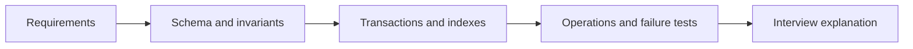

# PostgreSQL Production Projects

These ten blueprints force schema, transaction, isolation, index, migration, security, observability, backup and failure decisions to remain connected. Build them in order or choose the domain closest to your production work.

