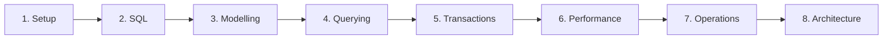

# PostgreSQL Learning Roadmap

## Phase 1 — Setup and SQL foundations

Install PostgreSQL 18.4 or run Docker. Learn `psql`, connection strings, schemas, tables, types, CRUD, expressions, NULL and formatting. Build a small schema without an ORM.

## Phase 2 — Relational design and integrity

Model identities and relationships, normalize stable facts, and enforce invariants with keys, constraints, generated columns and carefully chosen types.

## Phase 3 — Querying and analytics

Master joins, subqueries, CTEs, recursion, set operations, aggregation, windows, views and materialized views. Predict cardinality before running a query.

## Phase 4 — Transactions and concurrency

Understand snapshots, tuple visibility, isolation, row locks, advisory locks, deadlocks, retries, idempotency and `SKIP LOCKED`.

## Phase 5 — Indexes, plans and internals

Design workload-specific indexes. Read `EXPLAIN (ANALYZE, BUFFERS, WAL)`. Learn statistics, storage pages, TOAST, WAL, checkpoints, vacuum, autovacuum, HOT updates and bloat.

## Phase 6 — Security and operations

Create least-privilege roles, secure `search_path`, use SCRAM/TLS, plan backups, perform restore drills, monitor activity and statements, and rehearse incidents.

## Phase 7 — Replication, scaling and managed services

Reason about streaming and logical replication, slots, lag, failover, pooling, replicas, partitioning, caching, sharding and provider-specific limits.

## Phase 8 — Application architecture and mastery

Use `pg` from TypeScript, inspect ORM SQL, design migrations and transaction boundaries, build the ten production projects, complete 300 canonical exercises and practice 15 mock interview rounds.

## Evidence of mastery

You are production-ready when you can prevent invalid states, explain a real plan, diagnose a blocker, design a safe migration, restore a backup, reason about failover, and connect database behavior to application reliability.
