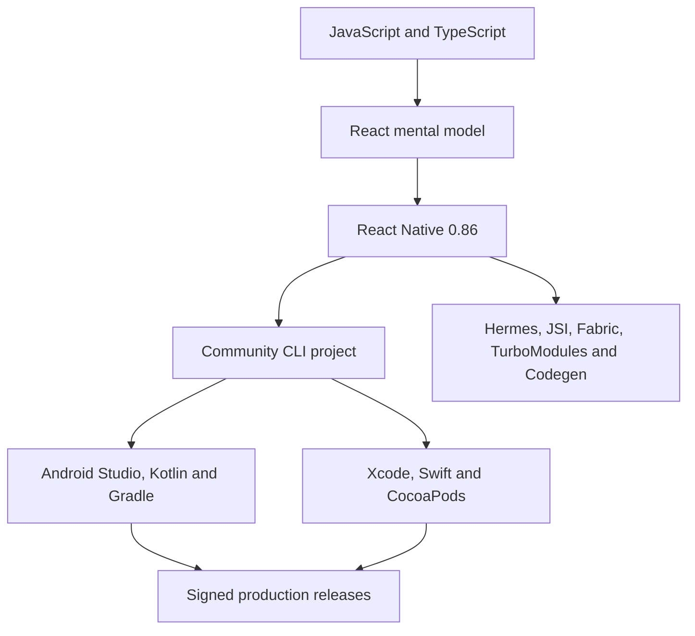

# React Native Community CLI Developer Handbook

This handbook teaches **React Native 0.86 with the React Native Community CLI**, native Android and iOS projects, Hermes, Metro, Fabric, TurboModules, JSI, Codegen, Gradle, CocoaPods, signing, testing, performance and store delivery. Expo is an optional ecosystem topic; it is not the primary development path.

The canonical project creation command for this dated baseline is:

```bash
npx @react-native-community/cli@latest init MyProject --version latest
```

The command asks the current Community CLI initializer to create a project from the current React Native template. Inside an existing application, keep the CLI package versions generated by the compatible template instead of independently forcing every CLI dependency to `latest`.



## Study order

1. Read the [version baseline](./version.md) before copying setup commands.
2. Follow the [roadmap](./roadmap.md) from environment setup through store deployment.
3. Build the ten [production projects](./projects/react-native-projects.md).
4. Complete the exact 300-exercise track.
5. Use the existing 400-question bank and 15 mock interview rounds for senior-level preparation.

## What you will own

A production React Native engineer owns more than JSX. You will learn to trace failures through React state, Metro resolution, Hermes execution, Fabric rendering, native modules, Gradle, Android manifests, Xcode projects, entitlements, CocoaPods, device permissions, signing identities, CI runners and app-store policy. The existing 200-topic archive remains available as a deep reference; the focused curriculum supplies canonical subject routes and a deliberate beginner-to-senior sequence.

## Boundaries

- **Framework behavior:** React and React Native rendering, components and lifecycle.
- **Tool behavior:** Community CLI, Metro, Gradle, Xcode and CocoaPods.
- **Platform behavior:** Android and iOS permissions, lifecycle, background execution and distribution.
- **Library behavior:** navigation, storage, forms, animation, notifications and device integrations.
- **Version-sensitive behavior:** release support, minimum targets, New Architecture status and native build requirements.

Treat these boundaries explicitly. A library README cannot override Android or Apple platform rules, and an old Bridge-era article is not a reliable explanation of a New-Architecture-only release.
