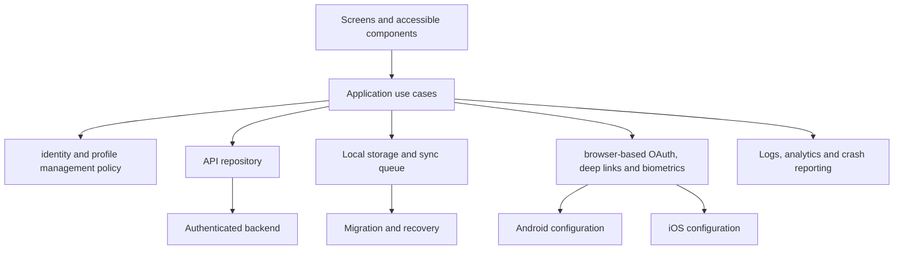

# Authentication and Profile Application

This project is a portfolio-quality Community CLI application, not a UI mock. It must run as native Android and iOS builds, survive realistic lifecycle and network failures, expose measurable quality gates and produce signed internal-release artifacts.

## Goals

Build a maintainable identity and profile management product with typed boundaries, accessible interaction, observable failures, secure configuration and deliberate Android/iOS ownership. Demonstrate end-to-end responsibility from product requirements through deployment and incident response.

## Requirements

- React Native 0.86 Community CLI project with strict TypeScript.
- Welcome, sign in, registration, verification, profile and security.
- Loading, empty, error, denied, offline, retry and expired-state UX.
- Android debug/release variants and iOS development/staging/production schemes.
- Release-device performance checks, crash reporting and privacy-safe analytics.

## User Stories

1. A user can complete the primary identity and profile management journey with clear feedback.
2. A user can recover from interruption, offline mode or a denied native capability.
3. A support engineer can correlate a failure with app version, build number and safe breadcrumbs.
4. A release engineer can produce repeatable Android and iOS internal builds without local secrets in source.

## Architecture

Use feature slices over explicit application, domain and adapter boundaries. Server state belongs in a query/cache layer; durable local data belongs behind a storage repository; native capabilities belong behind platform adapters.



## Directory Structure

```text
src/
  app/
  navigation/
  features/authentication-profile-application/
    application/
    domain/
    data/
    screens/
    components/
  platform/
  storage/
  observability/
  theme/
  testing/
```

## Module Boundaries

Presentation imports use cases and view models, not transport clients. Domain code has no React Native imports. API, storage and native implementations satisfy narrow ports. Cross-feature imports go through public indexes. Configuration is validated once during bootstrap.

## Screen Map

The required screens are: Welcome, sign in, registration, verification, profile and security. Each screen documents entry routes, ownership, loading/empty/error states, accessibility focus, analytics events and destructive-action confirmation.

## Navigation Flow

Use a typed root navigator with bootstrap, signed-out and signed-in branches. Validate deep-link and notification inputs before translating them into internal route intents. Persist navigation only when product value outweighs stale-state risk.

## State Model

Separate local interaction state, server cache, durable entities, session state, navigation state and native permission/capability state. Derive presentation values; do not mirror the same mutable object across a global store and query cache.

## Data Model

Core entities are User, Session, Device and Profile. Define stable IDs, timestamps, schema versions and ownership. Every queued mutation has an idempotency key, attempt count, next retry time and terminal failure reason.

## APIs

Expose typed endpoints with runtime validation, cancellation, timeout, bounded retry and normalized errors. Authentication refresh is single-flight. File operations use signed URLs or a backend-controlled upload contract. Server authorization remains authoritative.

## Persistence

Persist only what must survive process death. Store credentials in platform secure storage, ordinary cache in an appropriate database/key-value store and large media in the file system. Version every durable schema and test migrations from supported app versions.

## Offline Behavior

read-only cached profile with expired-session handling. Reads expose freshness. Writes are idempotent and queued with capped backoff. Conflict policy is domain-specific and visible to the user where automatic resolution could destroy intent.

## Android Configuration

Document manifest declarations, runtime permissions, SDK/library Gradle entries, product flavors, application IDs, signing configs, network security policy, R8 rules and notification channels where relevant. Test API 24 plus a current target device and at least one constrained physical device.

## iOS Configuration

Document Info.plist usage descriptions, URL schemes/universal links, capabilities, entitlements, pods, deployment target, bundle identifiers, schemes, xcconfig values, certificates and provisioning. Test simulator and physical-device behavior, then archive the staging scheme.

## Permissions

Request only at the moment of user intent, after a clear rationale. Handle unavailable, denied, limited and blocked states. Offer a manual fallback and settings route when appropriate. Never gate unrelated features behind unnecessary permissions.

## Validation

Validate API payloads, route parameters, external URLs, files, MIME types, form data and environment configuration. Client validation improves UX; backend validation and authorization protect the system.

## Error Handling

Use stable application errors with user-safe messages. Capture safe cause chains and breadcrumbs. Recovery includes retry, resume, discard, reauthenticate, open settings, export diagnostics or contact support depending on the failure.

## Accessibility

Provide labels, roles, states, hints, logical focus, dynamic text, minimum touch targets, screen-reader announcements and reduced motion. Test VoiceOver and TalkBack on the critical journey.

## Security

PKCE, secure token storage, rotation and revocation. Keep secrets out of bundles, validate deep links, redact observability data, minimize permissions and document dependency/native SDK risk. Client-side checks never replace server authorization.

## Performance

Set budgets for cold start, time to interactive, critical screen render, frame drops, memory, image size, network payload and app size. Profile release builds on representative Android and iOS devices before and after meaningful changes.

## Testing

Unit-test domain rules and sync transitions. Component-test user-visible states. Integration-test repositories and native adapters. E2E-test the primary journey, offline recovery and authentication. Include Android and iOS release smoke tests and a manual physical-device checklist.

## Build Configuration

Create development, staging and production identities with distinct API configuration, application/bundle IDs and analytics projects. Keep environment values non-secret; inject signing and provider credentials through protected CI variables.

## CI/CD

Run reproducible install, lint/type checks, unit/component tests, React Native validator, Mermaid validation and Docusaurus build for documentation changes. Mobile CI builds Android on Linux and iOS on a pinned macOS/Xcode runner, stores artifacts and supports internal distribution.

## Deployment

Generate a signed AAB for Play internal testing and an archived iOS build for TestFlight. Complete store metadata, privacy declarations and reviewer instructions. Use staged rollout/phased release, monitor crash-free sessions and preserve rollback capability.

## Failure Scenarios

Practice invalid callback, token race, blocked biometric and account lock. For each incident, record detection, user impact, containment, evidence, root cause, repair, rollout and prevention. Avoid random cache clearing before preserving the first useful logs.

## Extensions

Add feature flags, localization, tablet layouts, richer offline sync, background constraints, remote configuration, accessibility automation and a shared package only after the base boundaries are proven.

## Interview Discussion Points

Explain why each state lives where it does, how Android and iOS differ, how process death is handled, what is idempotent, how sensitive data is protected, which metrics gate rollout and how you would migrate the system during a React Native upgrade.
