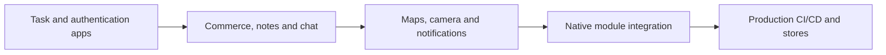

# React Native Production Projects

Complete the projects in order. Each blueprint includes native configuration, offline and failure behavior, accessibility, security, performance, tests, CI/CD and deployment.

1. [Community CLI Task Manager](./community-cli-task-manager.md) — task planning.
2. [Authentication and Profile Application](./authentication-profile-application.md) — identity and profile management.
3. [E-Commerce Mobile Application](./ecommerce-mobile-application.md) — catalog, cart and checkout.
4. [Offline-First Notes Application](./offline-first-notes-application.md) — notes and cross-device synchronization.
5. [Realtime Chat Application](./realtime-chat-application.md) — conversations and messaging.
6. [Location and Maps Application](./location-maps-application.md) — place discovery and route planning.
7. [Camera and Media Upload Application](./camera-media-upload-application.md) — capture, edit and resilient upload.
8. [Push Notification Application](./push-notification-application.md) — notification preferences and routed delivery.
9. [Native Module Integration Project](./native-module-integration-project.md) — typed cross-platform device diagnostics.
10. [Production Mobile Application with CI/CD and Store Deployment](./production-mobile-application.md) — multi-environment mobile SaaS delivery.

