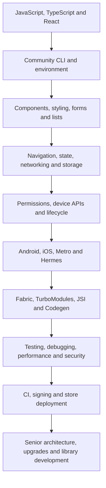

# React Native Learning Roadmap

This roadmap is ordered by dependency, not by API popularity. Do not jump directly to native modules before you can debug state, rendering, navigation, networking and build variants.

## Foundation stage

Learn React render purity, state snapshots, effects, refs, TypeScript narrowing and asynchronous error handling. Then install Android Studio, SDK tools, JDK 17, Xcode, simulators and CocoaPods. Create the first application with the direct Community CLI initializer and identify which command delegates to Metro, Gradle, adb, Xcode and simctl.

**Exit evidence:** you can build on Android and iOS, explain every top-level generated file, select a device, reset only the relevant cache and diagnose whether a failure belongs to package installation, Metro, native compilation, installation or launch.

## Product application stage

Build accessible components, responsive layouts, keyboard-safe forms, virtualized lists, typed navigation, authentication flow, API adapters, server-state caching and durable storage. Separate local interaction state, server state, persistent state, navigation state and native state.

**Exit evidence:** a multi-screen application handles loading, empty, error, retry, offline, denied permission and expired-session states without duplicating ownership.

## Native capability stage

Integrate permissions, camera, media, files, location, maps, notifications, background work, biometrics and deep links. For each native library, document installation, Android configuration, iOS configuration, permissions, cleanup, error handling, tests and common failures.

**Exit evidence:** you can trace an integration from TypeScript through autolinking and platform configuration to a physical device.

## Native engineering stage

Learn Kotlin/Java interop, Gradle variants, manifests, resources, signing and Logcat. Learn Swift/Objective-C interop, Xcode targets, schemes, capabilities, entitlements, CocoaPods, provisioning and crash logs. Build a small typed TurboModule and native component with Codegen.

**Exit evidence:** you can fix release-only native failures rather than treating `android/` and `ios/` as generated black boxes.

## Production stage

Measure startup, frame pacing, memory, bundle size, images and list rendering in release builds. Add deterministic tests, E2E coverage, crash reporting, analytics schemas, redaction, feature flags, secure storage, OAuth with PKCE, CI caching, signing secrets, internal distribution and staged rollout.

**Exit evidence:** you can release, observe and roll back Android and iOS builds safely.

## Senior and staff stage

Design feature boundaries, offline synchronization, conflict resolution, dependency governance, monorepos, shared packages, React Native libraries, release trains and incremental upgrades. Use the ten production projects, 300 exercises, 400-question bank and 15 mock interview rounds to practice trade-offs and incident response.

**Exit evidence:** you can explain not only how an API works, but who owns the state, what happens under process death, how each platform differs, which metrics prove success and how the system recovers.
