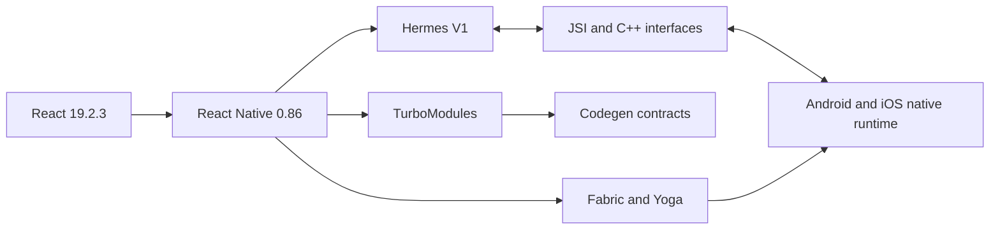

# React Native Version and Toolchain Baseline

**Research date: August 3, 2026.** React Native **0.86.x** is the current stable production line for this handbook. React Native 0.87 is scheduled for August 10, 2026 and is therefore treated as future behavior, not as the stable baseline.

| Area | Baseline | Engineering guidance |
|---|---|---|
| React Native | 0.86.x | Active stable line on the research date |
| Project creation | `npx @react-native-community/cli@latest init MyProject --version latest` | Use the direct Community CLI initializer; do not use removed `npx react-native init` guidance |
| React | 19.2.3 template relationship | Keep the React version selected by the RN template |
| Node.js | 22.11.0 or newer | Pin the same supported version in local development and CI |
| JDK | 17 recommended | Higher versions can require Gradle/toolchain changes |
| Android SDK | Platform and Build Tools 36 for the 0.86 environment | Verify template values before upgrades |
| Android minimum | API 24 | Test the true minimum and current target behavior |
| Xcode | 16.1 minimum for the 0.86 native helpers; current Xcode preferred | A Mac is required to build iOS native code |
| iOS deployment target | 15.1 | Library pods can raise the effective minimum |
| CocoaPods | Project-controlled through Gemfile and Bundler | Run `bundle exec pod install` for reproducibility |
| Hermes | Hermes V1 default | Test release bytecode, source maps and runtime differences |
| New Architecture | Required/current architecture | Legacy opt-out is unsupported from RN 0.82 onward |
| Fabric | Current renderer | Explain render, commit and mount rather than a universal old Bridge path |
| TurboModules | Current native-module model | Use typed specs and Codegen |
| JSI | Runtime/native interface | It enables direct runtime integration but does not make work free |
| Codegen | Build-integrated contract generation | Generated code must match Android and iOS implementations |
| Metro | Version-coupled RN bundler | Avoid independently upgrading core Metro packages without compatibility evidence |

## Stable creation workflow

```bash
npx @react-native-community/cli@latest init MyProject --version latest
cd MyProject
npm start
npm run android
npm run ios
```

The initializer selects a compatible template. The generated project then pins a dependency set for that React Native line. A global `react-native-cli` installation and the historical `npx react-native init` path are deprecated setup approaches.

## Platform verification

```bash
node --version
java -version
adb version
npx react-native doctor
xcodebuild -version
bundle exec pod --version
```

A successful version command is necessary but not sufficient. Validate an emulator, a physical device, a debug build and a release build. Android build behavior is jointly determined by Gradle, the Android Gradle Plugin, Kotlin, JDK, SDK levels and native dependencies. iOS behavior is jointly determined by Xcode, schemes, targets, build settings, certificates, provisioning profiles, CocoaPods and deployment targets.

## Architecture status



The legacy serialized Bridge remains important for migration and historical debugging, but it is not the universal execution path for modern React Native. Fabric owns rendering, TurboModules own the modern native-module contract, Codegen creates typed integration surfaces and JSI connects the JavaScript runtime with native/C++ facilities.

## Upgrade strategy

1. Read the React Native release post and support table.
2. Use Upgrade Helper or template diffs to identify native-project changes.
3. Check every native library against the target React Native minor, Android SDK/AGP/Gradle/Kotlin combination and Xcode/iOS target.
4. Upgrade on an isolated branch with reproducible lockfiles and Podfile.lock.
5. Run type checking, unit/component tests, Android and iOS release builds, device tests, performance checks and staged distribution.
6. Keep a rollback path until crash-free sessions, startup and critical journeys meet the release budget.

## Compatibility evidence

Prefer official React Native documentation, the React Native and Community Template repositories, Android developer documentation, Apple developer documentation, and the maintainer repository for each native dependency. Treat experimental features, release candidates and library-specific behavior as explicitly versioned material.
