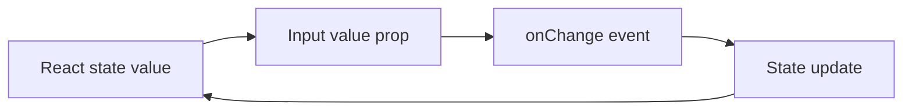

# Controlled Inputs

## What it is

A controlled input receives its current value from React state and reports edits through an event handler.

## Why it exists

Controlled inputs make React state the canonical source for validation, formatting, conditional UI, and coordinated form behavior.

## Beginner mental model

The browser proposes a new value; the owner decides the next state and renders it back.



## How React handles it

React works from immutable render descriptions and state snapshots. It may calculate a component more than once, compare the new description with previous work, and commit only the selected host changes. The public model in this lesson is the contract to rely on; private Fiber fields and internal flags are implementation details.

## TypeScript example

```tsx
import {useState} from 'react';

export function EmailField() {
  const [email, setEmail] = useState('');

  return (
    <label>
      Email
      <input
        type="email"
        value={email}
        onChange={(event) => setEmail(event.target.value)}
        autoComplete="email"
      />
    </label>
  );
}
```

## Common mistakes

- Switching between controlled and uncontrolled modes.
- Storing both raw and trivially derived field values.
- Validating only in the browser for a security-sensitive operation.

## Debugging guidance

Start with observable evidence:

1. Inspect the props, state, and event values for the render in question.
2. Use React DevTools to inspect ownership and committed updates.
3. Verify element type, position, and key when state or DOM identity behaves unexpectedly.
4. Reduce the example until one source of truth and one transition remain.
5. Check the browser accessibility tree and event behavior for interactive UI.

Avoid diagnosing correctness from `console.log` count alone. Development Strict Mode and concurrent rendering can repeat render calculations without producing an extra visible commit.

## Performance implications

Correct ownership comes before memoization. Measure render frequency, render cost, DOM size, network work, and user-visible interaction latency separately. Use memoization, virtualization, deferred work, or the React Compiler only after identifying the actual bottleneck.

## Accessibility and security

Preserve native HTML semantics, keyboard behavior, focus, and accessible names. Normal JSX interpolation escapes text, but URLs, raw HTML, uploads, authentication, authorization, and server mutations remain explicit trust boundaries. TypeScript improves developer feedback; it does not validate untrusted runtime data.

## When to use it

Use this concept when it makes the component's ownership, data flow, identity, or interaction contract clearer.

## When not to use it

Do not add an abstraction merely to imitate a pattern. Prefer the simplest model that preserves one source of truth, clear responsibilities, platform semantics, and testable behavior.

## Production considerations

Use controlled state when the UI genuinely needs every edit. For very large forms, consider a form library or uncontrolled strategy to reduce render pressure while preserving validation and accessibility.

Test the observable user behavior, including loading, empty, error, retry, keyboard, and permission states when relevant. Keep monitoring and rollback paths for changes that affect critical workflows.

## Interview explanation

A strong explanation names the problem, gives the mental model, describes React's public behavior, shows a small example, and ends with the trade-offs. Avoid reciting an API signature without explaining ownership and identity.

## Summary

- A controlled input receives its current value from React state and reports edits through an event handler.
- The browser proposes a new value; the owner decides the next state and renders it back.
- Correctness and clear ownership come before optimization.

## Practice exercises

1. Build a controlled checkbox.
2. Explain why value without onChange makes a field read-only.
3. Keep two related fields consistent without duplicate state.

## Official references

- https://react.dev/learn
- https://react.dev/reference/react
- https://www.typescriptlang.org/docs/handbook/jsx.html
