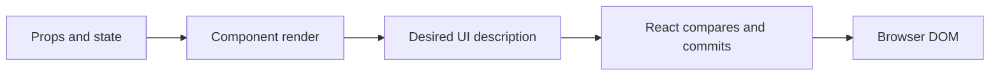

# Declarative vs Imperative UI

## What it is

Declarative UI describes the screen that should exist for the current data. Imperative UI describes the individual DOM operations required to reach that screen.

## Why it exists

React uses the declarative model so application code can express UI as a function of props and state instead of manually coordinating every mutation.

## Beginner mental model

Think of a component as a screen formula: give it a snapshot of data and it returns the UI description for that snapshot.



## How React handles it

React works from immutable render descriptions and state snapshots. It may calculate a component more than once, compare the new description with previous work, and commit only the selected host changes. The public model in this lesson is the contract to rely on; private Fiber fields and internal flags are implementation details.

## TypeScript example

```tsx
type StatusProps = {
  isSaving: boolean;
  error: string | null;
};

export function SaveStatus({isSaving, error}: StatusProps) {
  if (error) return <p role="alert">{error}</p>;
  return <p>{isSaving ? 'Saving…' : 'Saved'}</p>;
}
```

## Common mistakes

- Mutating DOM nodes that React owns instead of updating state.
- Treating declarative code as meaning React performs no imperative DOM work.
- Storing visual output in state when it can be derived during render.

## Debugging guidance

Start with observable evidence:

1. Inspect the props, state, and event values for the render in question.
2. Use React DevTools to inspect ownership and committed updates.
3. Verify element type, position, and key when state or DOM identity behaves unexpectedly.
4. Reduce the example until one source of truth and one transition remain.
5. Check the browser accessibility tree and event behavior for interactive UI.

Avoid diagnosing correctness from `console.log` count alone. Development Strict Mode and concurrent rendering can repeat render calculations without producing an extra visible commit.

## Performance implications

Correct ownership comes before memoization. Measure render frequency, render cost, DOM size, network work, and user-visible interaction latency separately. Use memoization, virtualization, deferred work, or the React Compiler only after identifying the actual bottleneck.

## Accessibility and security

Preserve native HTML semantics, keyboard behavior, focus, and accessible names. Normal JSX interpolation escapes text, but URLs, raw HTML, uploads, authentication, authorization, and server mutations remain explicit trust boundaries. TypeScript improves developer feedback; it does not validate untrusted runtime data.

## When to use it

Use this concept when it makes the component's ownership, data flow, identity, or interaction contract clearer.

## When not to use it

Do not add an abstraction merely to imitate a pattern. Prefer the simplest model that preserves one source of truth, clear responsibilities, platform semantics, and testable behavior.

## Production considerations

Keep imperative integrations behind narrow adapter components. Let React own the container boundary, and let the external library own only the DOM subtree explicitly assigned to it.

Test the observable user behavior, including loading, empty, error, retry, keyboard, and permission states when relevant. Keep monitoring and rollback paths for changes that affect critical workflows.

## Interview explanation

A strong explanation names the problem, gives the mental model, describes React's public behavior, shows a small example, and ends with the trade-offs. Avoid reciting an API signature without explaining ownership and identity.

## Summary

- Declarative UI describes the screen that should exist for the current data. Imperative UI describes the individual DOM operations required to reach that screen.
- Think of a component as a screen formula: give it a snapshot of data and it returns the UI description for that snapshot.
- Correctness and clear ownership come before optimization.

## Practice exercises

1. Rewrite a DOM-manipulation example as state-driven JSX.
2. Explain why directly changing an element that React owns can be overwritten.
3. Identify which parts of a legacy widget should remain imperative behind a React wrapper.

## Official references

- https://react.dev/learn
- https://react.dev/reference/react
- https://www.typescriptlang.org/docs/handbook/jsx.html
