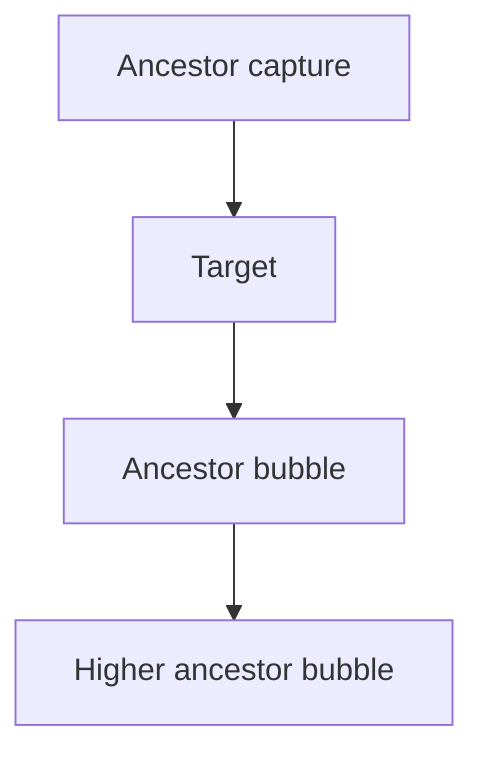

# Event Propagation

## What it is

Browser events move through capture and bubble phases; React handlers participate in that propagation model.

## Why it exists

Understanding propagation prevents accidental parent actions and enables intentional event delegation.

## Beginner mental model

The event starts at a target, travels through ancestors, and can be observed at defined phases.



## How React handles it

React works from immutable render descriptions and state snapshots. It may calculate a component more than once, compare the new description with previous work, and commit only the selected host changes. The public model in this lesson is the contract to rely on; private Fiber fields and internal flags are implementation details.

## TypeScript example

```tsx
export function ActionCard() {
  return (
    <article onClick={() => console.log('Open details')}>
      <button
        type="button"
        onClick={(event) => {
          event.stopPropagation();
          console.log('Delete item');
        }}
      >
        Delete
      </button>
    </article>
  );
}
```

## Common mistakes

- Calling preventDefault when the goal is stopping propagation.
- Using stopPropagation everywhere instead of fixing ownership.
- Creating nested interactive elements with conflicting semantics.

## Debugging guidance

Start with observable evidence:

1. Inspect the props, state, and event values for the render in question.
2. Use React DevTools to inspect ownership and committed updates.
3. Verify element type, position, and key when state or DOM identity behaves unexpectedly.
4. Reduce the example until one source of truth and one transition remain.
5. Check the browser accessibility tree and event behavior for interactive UI.

Avoid diagnosing correctness from `console.log` count alone. Development Strict Mode and concurrent rendering can repeat render calculations without producing an extra visible commit.

## Performance implications

Correct ownership comes before memoization. Measure render frequency, render cost, DOM size, network work, and user-visible interaction latency separately. Use memoization, virtualization, deferred work, or the React Compiler only after identifying the actual bottleneck.

## Accessibility and security

Preserve native HTML semantics, keyboard behavior, focus, and accessible names. Normal JSX interpolation escapes text, but URLs, raw HTML, uploads, authentication, authorization, and server mutations remain explicit trust boundaries. TypeScript improves developer feedback; it does not validate untrusted runtime data.

## When to use it

Use this concept when it makes the component's ownership, data flow, identity, or interaction contract clearer.

## When not to use it

Do not add an abstraction merely to imitate a pattern. Prefer the simplest model that preserves one source of truth, clear responsibilities, platform semantics, and testable behavior.

## Production considerations

Prefer semantic elements and clear interaction ownership. Propagation control should be deliberate, documented, and tested with keyboard as well as pointer input.

Test the observable user behavior, including loading, empty, error, retry, keyboard, and permission states when relevant. Keep monitoring and rollback paths for changes that affect critical workflows.

## Interview explanation

A strong explanation names the problem, gives the mental model, describes React's public behavior, shows a small example, and ends with the trade-offs. Avoid reciting an API signature without explaining ownership and identity.

## Summary

- Browser events move through capture and bubble phases; React handlers participate in that propagation model.
- The event starts at a target, travels through ancestors, and can be observed at defined phases.
- Correctness and clear ownership come before optimization.

## Practice exercises

1. Trace capture and bubble order for nested handlers.
2. Explain stopPropagation versus preventDefault.
3. Replace a clickable div with the correct interactive element.

## Official references

- https://react.dev/learn
- https://react.dev/reference/react
- https://www.typescriptlang.org/docs/handbook/jsx.html
