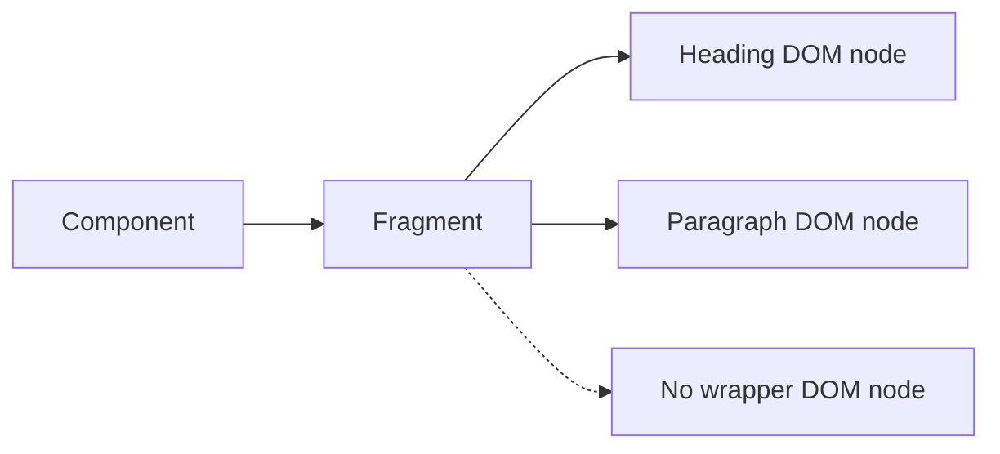

# Fragments

## What it is

A Fragment groups multiple React children without adding an extra host DOM element.

## Why it exists

Fragments satisfy the need for one returned value while preserving semantic DOM structure.

## Beginner mental model

A Fragment exists in the React tree but does not create a wrapper element in the host tree.



## How React handles it

React works from immutable render descriptions and state snapshots. It may calculate a component more than once, compare the new description with previous work, and commit only the selected host changes. The public model in this lesson is the contract to rely on; private Fiber fields and internal flags are implementation details.

## TypeScript example

```tsx
import {Fragment} from 'react';

type Term = {id: string; name: string; definition: string};

export function Glossary({terms}: {terms: Term[]}) {
  return (
    <dl>
      {terms.map((term) => (
        <Fragment key={term.id}>
          <dt>{term.name}</dt>
          <dd>{term.definition}</dd>
        </Fragment>
      ))}
    </dl>
  );
}
```

## Common mistakes

- Using a Fragment where a semantic container is required.
- Trying to put a key on the shorthand syntax.
- Removing a wrapper that was needed for layout or accessibility.

## Debugging guidance

Start with observable evidence:

1. Inspect the props, state, and event values for the render in question.
2. Use React DevTools to inspect ownership and committed updates.
3. Verify element type, position, and key when state or DOM identity behaves unexpectedly.
4. Reduce the example until one source of truth and one transition remain.
5. Check the browser accessibility tree and event behavior for interactive UI.

Avoid diagnosing correctness from `console.log` count alone. Development Strict Mode and concurrent rendering can repeat render calculations without producing an extra visible commit.

## Performance implications

Correct ownership comes before memoization. Measure render frequency, render cost, DOM size, network work, and user-visible interaction latency separately. Use memoization, virtualization, deferred work, or the React Compiler only after identifying the actual bottleneck.

## Accessibility and security

Preserve native HTML semantics, keyboard behavior, focus, and accessible names. Normal JSX interpolation escapes text, but URLs, raw HTML, uploads, authentication, authorization, and server mutations remain explicit trust boundaries. TypeScript improves developer feedback; it does not validate untrusted runtime data.

## When to use it

Use this concept when it makes the component's ownership, data flow, identity, or interaction contract clearer.

## When not to use it

Do not add an abstraction merely to imitate a pattern. Prefer the simplest model that preserves one source of truth, clear responsibilities, platform semantics, and testable behavior.

## Production considerations

Use Fragments to avoid meaningless markup, not to hide missing semantics. Landmarks, headings, list containers, and form groups still need appropriate HTML elements.

Test the observable user behavior, including loading, empty, error, retry, keyboard, and permission states when relevant. Keep monitoring and rollback paths for changes that affect critical workflows.

## Interview explanation

A strong explanation names the problem, gives the mental model, describes React's public behavior, shows a small example, and ends with the trade-offs. Avoid reciting an API signature without explaining ownership and identity.

## Summary

- A Fragment groups multiple React children without adding an extra host DOM element.
- A Fragment exists in the React tree but does not create a wrapper element in the host tree.
- Correctness and clear ownership come before optimization.

## Practice exercises

1. Replace a meaningless wrapper with a Fragment.
2. Explain why shorthand fragments cannot receive a key.
3. Choose between a semantic section and a Fragment.

## Official references

- https://react.dev/learn
- https://react.dev/reference/react
- https://www.typescriptlang.org/docs/handbook/jsx.html
