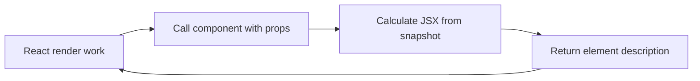

# Function Components

## What it is

A function component is a React-controlled function that receives props and returns a renderable React value.

## Why it exists

Function components are the standard modern unit for expressing React UI and composing Hooks.

## Beginner mental model

React calls the component as part of rendering; application code describes it with JSX rather than invoking it directly.



## How React handles it

React works from immutable render descriptions and state snapshots. It may calculate a component more than once, compare the new description with previous work, and commit only the selected host changes. The public model in this lesson is the contract to rely on; private Fiber fields and internal flags are implementation details.

## TypeScript example

```tsx
type AvatarProps = {
  name: string;
  imageUrl: string;
};

export function Avatar({name, imageUrl}: AvatarProps) {
  return ;
}
```

## Common mistakes

- Calling a component function manually.
- Declaring components inside another component without a deliberate reason.
- Performing network, storage, or DOM mutations during render.

## Debugging guidance

Start with observable evidence:

1. Inspect the props, state, and event values for the render in question.
2. Use React DevTools to inspect ownership and committed updates.
3. Verify element type, position, and key when state or DOM identity behaves unexpectedly.
4. Reduce the example until one source of truth and one transition remain.
5. Check the browser accessibility tree and event behavior for interactive UI.

Avoid diagnosing correctness from `console.log` count alone. Development Strict Mode and concurrent rendering can repeat render calculations without producing an extra visible commit.

## Performance implications

Correct ownership comes before memoization. Measure render frequency, render cost, DOM size, network work, and user-visible interaction latency separately. Use memoization, virtualization, deferred work, or the React Compiler only after identifying the actual bottleneck.

## Accessibility and security

Preserve native HTML semantics, keyboard behavior, focus, and accessible names. Normal JSX interpolation escapes text, but URLs, raw HTML, uploads, authentication, authorization, and server mutations remain explicit trust boundaries. TypeScript improves developer feedback; it does not validate untrusted runtime data.

## When to use it

Use this concept when it makes the component's ownership, data flow, identity, or interaction contract clearer.

## When not to use it

Do not add an abstraction merely to imitate a pattern. Prefer the simplest model that preserves one source of truth, clear responsibilities, platform semantics, and testable behavior.

## Production considerations

Keep component execution pure and cheap enough to repeat. React may render more than once, interrupt work, or discard an unfinished render before commit.

Test the observable user behavior, including loading, empty, error, retry, keyboard, and permission states when relevant. Keep monitoring and rollback paths for changes that affect critical workflows.

## Interview explanation

A strong explanation names the problem, gives the mental model, describes React's public behavior, shows a small example, and ends with the trade-offs. Avoid reciting an API signature without explaining ownership and identity.

## Summary

- A function component is a React-controlled function that receives props and returns a renderable React value.
- React calls the component as part of rendering; application code describes it with JSX rather than invoking it directly.
- Correctness and clear ownership come before optimization.

## Practice exercises

1. Write a typed function component without React.FC.
2. Explain why component names begin with a capital letter.
3. Identify a side effect that should not run during component execution.

## Official references

- https://react.dev/learn
- https://react.dev/reference/react
- https://www.typescriptlang.org/docs/handbook/jsx.html
