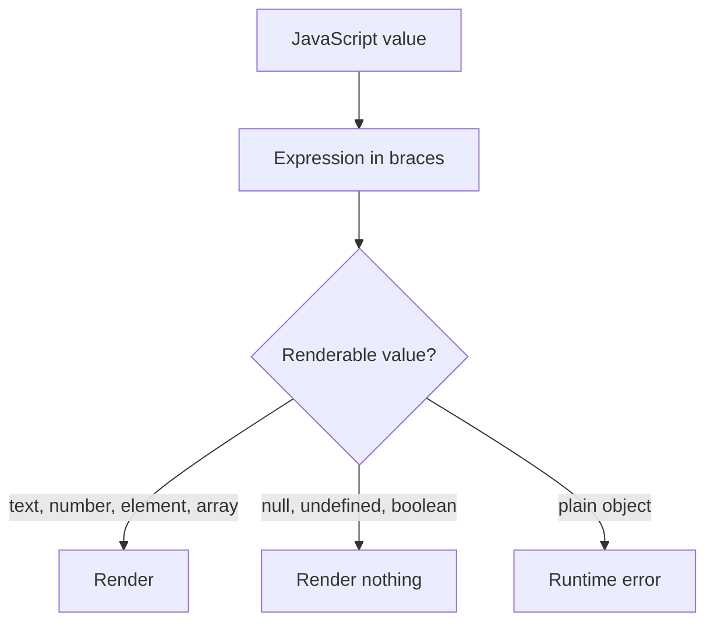

# JSX Expressions

## What it is

Curly braces in JSX allow JavaScript expression values to participate in attributes or children.

## Why it exists

Expressions connect application data and decisions to the UI without introducing a separate template language.

## Beginner mental model

Inside braces, React receives the value produced by the expression; statements such as if or for must run outside the braces.



## How React handles it

React works from immutable render descriptions and state snapshots. It may calculate a component more than once, compare the new description with previous work, and commit only the selected host changes. The public model in this lesson is the contract to rely on; private Fiber fields and internal flags are implementation details.

## TypeScript example

```tsx
type PriceProps = {
  amount: number;
  currency: string;
  discounted: boolean;
};

export function Price({amount, currency, discounted}: PriceProps) {
  const label = new Intl.NumberFormat('en', {
    style: 'currency',
    currency,
  }).format(amount);

  return <p>{discounted ? <del>{label}</del> : label}</p>;
}
```

## Common mistakes

- Putting statements directly inside JSX braces.
- Rendering a plain object as a child.
- Using a numeric value directly with && and accidentally rendering 0.

## Debugging guidance

Start with observable evidence:

1. Inspect the props, state, and event values for the render in question.
2. Use React DevTools to inspect ownership and committed updates.
3. Verify element type, position, and key when state or DOM identity behaves unexpectedly.
4. Reduce the example until one source of truth and one transition remain.
5. Check the browser accessibility tree and event behavior for interactive UI.

Avoid diagnosing correctness from `console.log` count alone. Development Strict Mode and concurrent rendering can repeat render calculations without producing an extra visible commit.

## Performance implications

Correct ownership comes before memoization. Measure render frequency, render cost, DOM size, network work, and user-visible interaction latency separately. Use memoization, virtualization, deferred work, or the React Compiler only after identifying the actual bottleneck.

## Accessibility and security

Preserve native HTML semantics, keyboard behavior, focus, and accessible names. Normal JSX interpolation escapes text, but URLs, raw HTML, uploads, authentication, authorization, and server mutations remain explicit trust boundaries. TypeScript improves developer feedback; it does not validate untrusted runtime data.

## When to use it

Use this concept when it makes the component's ownership, data flow, identity, or interaction contract clearer.

## When not to use it

Do not add an abstraction merely to imitate a pattern. Prefer the simplest model that preserves one source of truth, clear responsibilities, platform semantics, and testable behavior.

## Production considerations

Keep complex domain calculations outside the returned markup. JSX should reveal structure and small UI decisions, while reusable calculations live in pure functions or domain modules.

Test the observable user behavior, including loading, empty, error, retry, keyboard, and permission states when relevant. Keep monitoring and rollback paths for changes that affect critical workflows.

## Interview explanation

A strong explanation names the problem, gives the mental model, describes React's public behavior, shows a small example, and ends with the trade-offs. Avoid reciting an API signature without explaining ownership and identity.

## Summary

- Curly braces in JSX allow JavaScript expression values to participate in attributes or children.
- Inside braces, React receives the value produced by the expression; statements such as if or for must run outside the braces.
- Correctness and clear ownership come before optimization.

## Practice exercises

1. List which JavaScript values React can render as children.
2. Replace a nested ternary with clearer precomputed values.
3. Debug a component that renders the number 0 unexpectedly.

## Official references

- https://react.dev/learn
- https://react.dev/reference/react
- https://www.typescriptlang.org/docs/handbook/jsx.html
