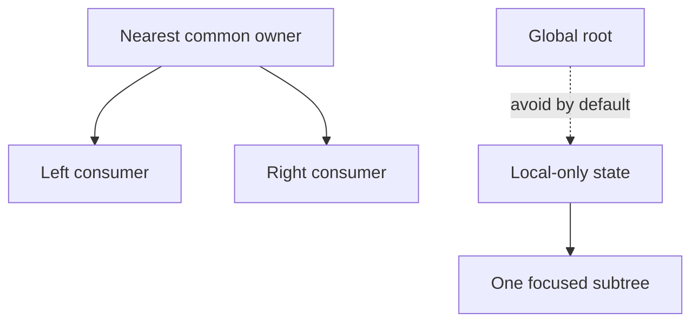

# Lifting and Colocating State

## What it is

State should live in the nearest component that must own and coordinate it. Lifting moves ownership upward; colocation keeps ownership near its use.

## Why it exists

Correct placement gives all required consumers one source of truth without causing unnecessarily broad updates.

## Beginner mental model

Move state only as high as necessary and no higher.



## How React handles it

React works from immutable render descriptions and state snapshots. It may calculate a component more than once, compare the new description with previous work, and commit only the selected host changes. The public model in this lesson is the contract to rely on; private Fiber fields and internal flags are implementation details.

## TypeScript example

```tsx
import {useState} from 'react';

export function TemperatureCalculator() {
  const [celsius, setCelsius] = useState(0);
  const fahrenheit = celsius * 9 / 5 + 32;

  return (
    <>
      <input
        type="number"
        value={celsius}
        onChange={(event) => setCelsius(Number(event.target.value))}
      />
      <output>{fahrenheit.toFixed(1)} °F</output>
    </>
  );
}
```

## Common mistakes

- Putting all state in a global store.
- Duplicating the same state in siblings.
- Lifting transient input state to the app root without a consumer need.

## Debugging guidance

Start with observable evidence:

1. Inspect the props, state, and event values for the render in question.
2. Use React DevTools to inspect ownership and committed updates.
3. Verify element type, position, and key when state or DOM identity behaves unexpectedly.
4. Reduce the example until one source of truth and one transition remain.
5. Check the browser accessibility tree and event behavior for interactive UI.

Avoid diagnosing correctness from `console.log` count alone. Development Strict Mode and concurrent rendering can repeat render calculations without producing an extra visible commit.

## Performance implications

Correct ownership comes before memoization. Measure render frequency, render cost, DOM size, network work, and user-visible interaction latency separately. Use memoization, virtualization, deferred work, or the React Compiler only after identifying the actual bottleneck.

## Accessibility and security

Preserve native HTML semantics, keyboard behavior, focus, and accessible names. Normal JSX interpolation escapes text, but URLs, raw HTML, uploads, authentication, authorization, and server mutations remain explicit trust boundaries. TypeScript improves developer feedback; it does not validate untrusted runtime data.

## When to use it

Use this concept when it makes the component's ownership, data flow, identity, or interaction contract clearer.

## When not to use it

Do not add an abstraction merely to imitate a pattern. Prefer the simplest model that preserves one source of truth, clear responsibilities, platform semantics, and testable behavior.

## Production considerations

State placement is a performance and maintainability decision. Separate server cache, URL state, form state, and durable workflow state rather than forcing every category into one tool.

Test the observable user behavior, including loading, empty, error, retry, keyboard, and permission states when relevant. Keep monitoring and rollback paths for changes that affect critical workflows.

## Interview explanation

A strong explanation names the problem, gives the mental model, describes React's public behavior, shows a small example, and ends with the trade-offs. Avoid reciting an API signature without explaining ownership and identity.

## Summary

- State should live in the nearest component that must own and coordinate it. Lifting moves ownership upward; colocation keeps ownership near its use.
- Move state only as high as necessary and no higher.
- Correctness and clear ownership come before optimization.

## Practice exercises

1. Find the nearest common owner for two synchronized inputs.
2. Move modal-open state closer to the modal trigger.
3. Classify local, URL, server, and shared client state.

## Official references

- https://react.dev/learn
- https://react.dev/reference/react
- https://www.typescriptlang.org/docs/handbook/jsx.html
