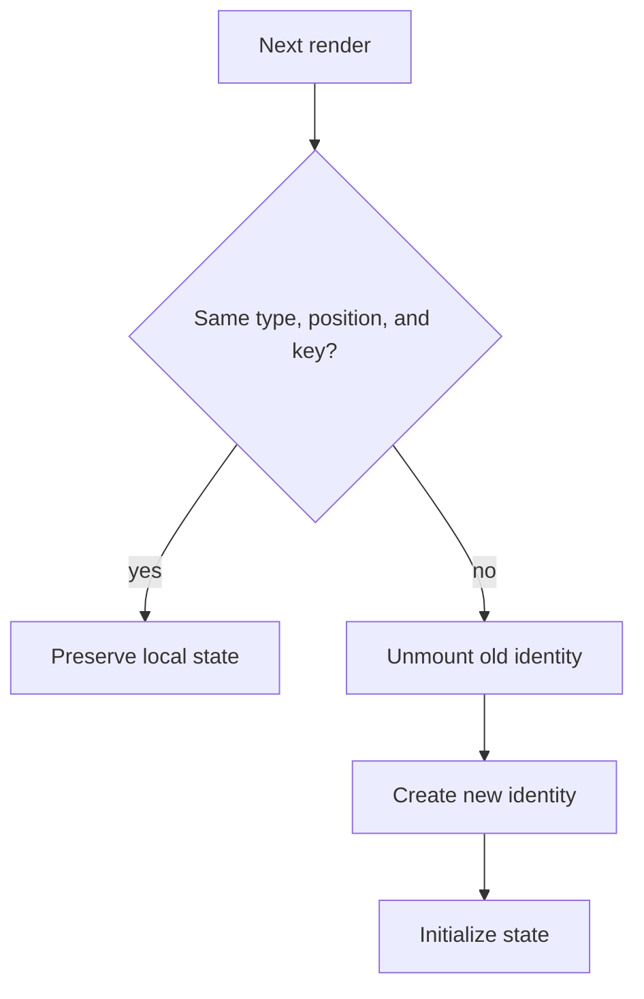

# Preserving and Resetting State

## What it is

React preserves local state while a component retains the same identity at the same position; changing type, position, or key can reset it.

## Why it exists

Applications need predictable continuity during re-renders and deliberate resets when the represented entity changes.

## Beginner mental model

State belongs to a position in the rendered tree, not to a line of JSX source.



## How React handles it

React works from immutable render descriptions and state snapshots. It may calculate a component more than once, compare the new description with previous work, and commit only the selected host changes. The public model in this lesson is the contract to rely on; private Fiber fields and internal flags are implementation details.

## TypeScript example

```tsx
import {useState} from 'react';

export function AccountForm({accountId}: {accountId: string}) {
  return <AccountEditor key={accountId} />;
}

function AccountEditor() {
  const [notes, setNotes] = useState('');
  return <textarea value={notes} onChange={(event) => setNotes(event.target.value)} />;
}
```

## Common mistakes

- Using random keys and resetting state every render.
- Assuming variable names control state identity.
- Keeping stale entity-specific state when the entity ID changes.

## Debugging guidance

Start with observable evidence:

1. Inspect the props, state, and event values for the render in question.
2. Use React DevTools to inspect ownership and committed updates.
3. Verify element type, position, and key when state or DOM identity behaves unexpectedly.
4. Reduce the example until one source of truth and one transition remain.
5. Check the browser accessibility tree and event behavior for interactive UI.

Avoid diagnosing correctness from `console.log` count alone. Development Strict Mode and concurrent rendering can repeat render calculations without producing an extra visible commit.

## Performance implications

Correct ownership comes before memoization. Measure render frequency, render cost, DOM size, network work, and user-visible interaction latency separately. Use memoization, virtualization, deferred work, or the React Compiler only after identifying the actual bottleneck.

## Accessibility and security

Preserve native HTML semantics, keyboard behavior, focus, and accessible names. Normal JSX interpolation escapes text, but URLs, raw HTML, uploads, authentication, authorization, and server mutations remain explicit trust boundaries. TypeScript improves developer feedback; it does not validate untrusted runtime data.

## When to use it

Use this concept when it makes the component's ownership, data flow, identity, or interaction contract clearer.

## When not to use it

Do not add an abstraction merely to imitate a pattern. Prefer the simplest model that preserves one source of truth, clear responsibilities, platform semantics, and testable behavior.

## Production considerations

Deliberate resets should consider unsaved work, focus, analytics, and recovery. For hidden-but-preserved workflows, evaluate whether memory and stale data risks justify preserving the subtree.

Test the observable user behavior, including loading, empty, error, retry, keyboard, and permission states when relevant. Keep monitoring and rollback paths for changes that affect critical workflows.

## Interview explanation

A strong explanation names the problem, gives the mental model, describes React's public behavior, shows a small example, and ends with the trade-offs. Avoid reciting an API signature without explaining ownership and identity.

## Summary

- React preserves local state while a component retains the same identity at the same position; changing type, position, or key can reset it.
- State belongs to a position in the rendered tree, not to a line of JSX source.
- Correctness and clear ownership come before optimization.

## Practice exercises

1. Use a key to reset a form for a new entity.
2. Refactor conditional branches that accidentally reset state.
3. Explain the difference between hiding, unmounting, and Activity.

## Official references

- https://react.dev/learn
- https://react.dev/reference/react
- https://www.typescriptlang.org/docs/handbook/jsx.html
