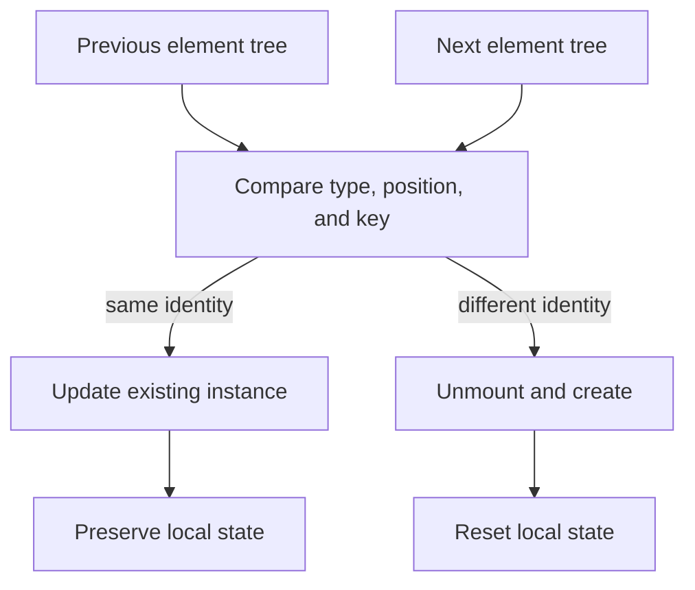

# Reconciliation

## What it is

Reconciliation is React's process for comparing the previous and next element trees to decide what identities and host nodes can be preserved.

## Why it exists

React needs a predictable way to update only what is necessary while preserving component state correctly.

## Beginner mental model

Type, position, and key form the identity clues React uses among siblings.



## How React handles it

React works from immutable render descriptions and state snapshots. It may calculate a component more than once, compare the new description with previous work, and commit only the selected host changes. The public model in this lesson is the contract to rely on; private Fiber fields and internal flags are implementation details.

## TypeScript example

```tsx
import {useState} from 'react';

export function ProfileEditor({userId}: {userId: string}) {
  return <Editor key={userId} />;
}

function Editor() {
  const [draft, setDraft] = useState('');
  return <input value={draft} onChange={(event) => setDraft(event.target.value)} />;
}
```

## Common mistakes

- Assuming matching DOM markup guarantees matching component identity.
- Moving component definitions inside render and causing new types.
- Using unstable keys that force replacement.

## Debugging guidance

Start with observable evidence:

1. Inspect the props, state, and event values for the render in question.
2. Use React DevTools to inspect ownership and committed updates.
3. Verify element type, position, and key when state or DOM identity behaves unexpectedly.
4. Reduce the example until one source of truth and one transition remain.
5. Check the browser accessibility tree and event behavior for interactive UI.

Avoid diagnosing correctness from `console.log` count alone. Development Strict Mode and concurrent rendering can repeat render calculations without producing an extra visible commit.

## Performance implications

Correct ownership comes before memoization. Measure render frequency, render cost, DOM size, network work, and user-visible interaction latency separately. Use memoization, virtualization, deferred work, or the React Compiler only after identifying the actual bottleneck.

## Accessibility and security

Preserve native HTML semantics, keyboard behavior, focus, and accessible names. Normal JSX interpolation escapes text, but URLs, raw HTML, uploads, authentication, authorization, and server mutations remain explicit trust boundaries. TypeScript improves developer feedback; it does not validate untrusted runtime data.

## When to use it

Use this concept when it makes the component's ownership, data flow, identity, or interaction contract clearer.

## When not to use it

Do not add an abstraction merely to imitate a pattern. Prefer the simplest model that preserves one source of truth, clear responsibilities, platform semantics, and testable behavior.

## Production considerations

Do not code against private Fiber fields. Use the public identity model—component type, tree position, and keys—to reason about preservation and resets.

Test the observable user behavior, including loading, empty, error, retry, keyboard, and permission states when relevant. Keep monitoring and rollback paths for changes that affect critical workflows.

## Interview explanation

A strong explanation names the problem, gives the mental model, describes React's public behavior, shows a small example, and ends with the trade-offs. Avoid reciting an API signature without explaining ownership and identity.

## Summary

- Reconciliation is React's process for comparing the previous and next element trees to decide what identities and host nodes can be preserved.
- Type, position, and key form the identity clues React uses among siblings.
- Correctness and clear ownership come before optimization.

## Practice exercises

1. Predict which state survives a conditional branch.
2. Explain how type and key affect identity.
3. Use React DevTools to diagnose an unexpected remount.

## Official references

- https://react.dev/learn
- https://react.dev/reference/react
- https://www.typescriptlang.org/docs/handbook/jsx.html
