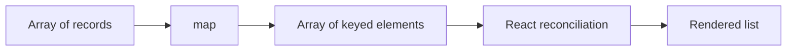

# Rendering Lists

## What it is

React renders collections by mapping data items to element descriptions.

## Why it exists

List rendering connects normalized application data to repeated UI while keeping each item independently composable.

## Beginner mental model

Transform data into elements; do not mutate the source array during render.



## How React handles it

React works from immutable render descriptions and state snapshots. It may calculate a component more than once, compare the new description with previous work, and commit only the selected host changes. The public model in this lesson is the contract to rely on; private Fiber fields and internal flags are implementation details.

## TypeScript example

```tsx
type Task = {id: string; title: string; completed: boolean};

export function TaskList({tasks}: {tasks: Task[]}) {
  const visibleTasks = tasks.filter((task) => !task.completed);

  return (
    <ul>
      {visibleTasks.map((task) => (
        <li key={task.id}>{task.title}</li>
      ))}
    </ul>
  );
}
```

## Common mistakes

- Using forEach when a returned array is needed.
- Sorting a prop array in place.
- Placing list semantics on div elements when ul/ol is appropriate.

## Debugging guidance

Start with observable evidence:

1. Inspect the props, state, and event values for the render in question.
2. Use React DevTools to inspect ownership and committed updates.
3. Verify element type, position, and key when state or DOM identity behaves unexpectedly.
4. Reduce the example until one source of truth and one transition remain.
5. Check the browser accessibility tree and event behavior for interactive UI.

Avoid diagnosing correctness from `console.log` count alone. Development Strict Mode and concurrent rendering can repeat render calculations without producing an extra visible commit.

## Performance implications

Correct ownership comes before memoization. Measure render frequency, render cost, DOM size, network work, and user-visible interaction latency separately. Use memoization, virtualization, deferred work, or the React Compiler only after identifying the actual bottleneck.

## Accessibility and security

Preserve native HTML semantics, keyboard behavior, focus, and accessible names. Normal JSX interpolation escapes text, but URLs, raw HTML, uploads, authentication, authorization, and server mutations remain explicit trust boundaries. TypeScript improves developer feedback; it does not validate untrusted runtime data.

## When to use it

Use this concept when it makes the component's ownership, data flow, identity, or interaction contract clearer.

## When not to use it

Do not add an abstraction merely to imitate a pattern. Prefer the simplest model that preserves one source of truth, clear responsibilities, platform semantics, and testable behavior.

## Production considerations

For very large collections, separate data pagination from DOM virtualization. Preserve semantic list structure where possible and measure rendering cost before adding optimization complexity.

Test the observable user behavior, including loading, empty, error, retry, keyboard, and permission states when relevant. Keep monitoring and rollback paths for changes that affect critical workflows.

## Interview explanation

A strong explanation names the problem, gives the mental model, describes React's public behavior, shows a small example, and ends with the trade-offs. Avoid reciting an API signature without explaining ownership and identity.

## Summary

- React renders collections by mapping data items to element descriptions.
- Transform data into elements; do not mutate the source array during render.
- Correctness and clear ownership come before optimization.

## Practice exercises

1. Render a filtered and sorted list without mutating props.
2. Add a clear empty-state branch.
3. Extract a reusable list item component.

## Official references

- https://react.dev/learn
- https://react.dev/reference/react
- https://www.typescriptlang.org/docs/handbook/jsx.html
