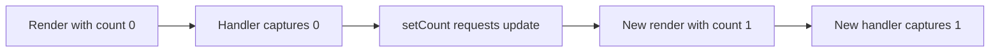

# State as a Snapshot

## What it is

State read during a render is a fixed snapshot for that render; setting state requests a future render rather than changing the current variable.

## Why it exists

Snapshot semantics keep each render internally consistent and make queued updates predictable.

## Beginner mental model

Every render receives its own photograph of state and creates handlers that close over that photograph.



## How React handles it

React works from immutable render descriptions and state snapshots. It may calculate a component more than once, compare the new description with previous work, and commit only the selected host changes. The public model in this lesson is the contract to rely on; private Fiber fields and internal flags are implementation details.

## TypeScript example

```tsx
import {useState} from 'react';

export function DelayedAlert() {
  const [message, setMessage] = useState('Hello');

  function handleShow() {
    const snapshot = message;
    setTimeout(() => alert(snapshot), 1000);
  }

  return (
    <>
      <input value={message} onChange={(event) => setMessage(event.target.value)} />
      <button onClick={handleShow}>Show later</button>
    </>
  );
}
```

## Common mistakes

- Expecting state to change immediately in the current handler.
- Calling multiple next-value updates based on the same stale snapshot.
- Using refs to bypass snapshot semantics instead of modeling state correctly.

## Debugging guidance

Start with observable evidence:

1. Inspect the props, state, and event values for the render in question.
2. Use React DevTools to inspect ownership and committed updates.
3. Verify element type, position, and key when state or DOM identity behaves unexpectedly.
4. Reduce the example until one source of truth and one transition remain.
5. Check the browser accessibility tree and event behavior for interactive UI.

Avoid diagnosing correctness from `console.log` count alone. Development Strict Mode and concurrent rendering can repeat render calculations without producing an extra visible commit.

## Performance implications

Correct ownership comes before memoization. Measure render frequency, render cost, DOM size, network work, and user-visible interaction latency separately. Use memoization, virtualization, deferred work, or the React Compiler only after identifying the actual bottleneck.

## Accessibility and security

Preserve native HTML semantics, keyboard behavior, focus, and accessible names. Normal JSX interpolation escapes text, but URLs, raw HTML, uploads, authentication, authorization, and server mutations remain explicit trust boundaries. TypeScript improves developer feedback; it does not validate untrusted runtime data.

## When to use it

Use this concept when it makes the component's ownership, data flow, identity, or interaction contract clearer.

## When not to use it

Do not add an abstraction merely to imitate a pattern. Prefer the simplest model that preserves one source of truth, clear responsibilities, platform semantics, and testable behavior.

## Production considerations

Snapshot behavior is a correctness feature. Make async workflows explicit about which version of data they use, and guard against stale network responses before committing results.

Test the observable user behavior, including loading, empty, error, retry, keyboard, and permission states when relevant. Keep monitoring and rollback paths for changes that affect critical workflows.

## Interview explanation

A strong explanation names the problem, gives the mental model, describes React's public behavior, shows a small example, and ends with the trade-offs. Avoid reciting an API signature without explaining ownership and identity.

## Summary

- State read during a render is a fixed snapshot for that render; setting state requests a future render rather than changing the current variable.
- Every render receives its own photograph of state and creates handlers that close over that photograph.
- Correctness and clear ownership come before optimization.

## Practice exercises

1. Predict what a delayed handler logs after state changes.
2. Explain why a setState call does not mutate the current variable.
3. Use a ref when the latest mutable value is genuinely required.

## Official references

- https://react.dev/learn
- https://react.dev/reference/react
- https://www.typescriptlang.org/docs/handbook/jsx.html
