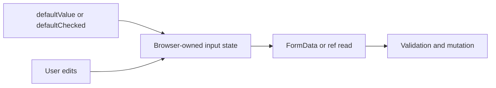

# Uncontrolled Inputs and File Inputs

## What it is

An uncontrolled input keeps its current value in the DOM and is read through form submission or a ref. File inputs are necessarily browser-owned.

## Why it exists

This model can reduce state wiring and works naturally with platform FormData and progressive form behavior.

## Beginner mental model

React configures the field, while the browser owns its live value until the application reads it.



## How React handles it

React works from immutable render descriptions and state snapshots. It may calculate a component more than once, compare the new description with previous work, and commit only the selected host changes. The public model in this lesson is the contract to rely on; private Fiber fields and internal flags are implementation details.

## TypeScript example

```tsx
export function UploadForm() {
  function handleSubmit(event: React.FormEvent<HTMLFormElement>) {
    event.preventDefault();
    const data = new FormData(event.currentTarget);
    const file = data.get('document');

    if (!(file instanceof File) || file.size === 0) return;
    console.log(file.name);
  }

  return (
    <form onSubmit={handleSubmit}>
      <label>
        Document
        <input name="document" type="file" accept=".pdf,image/*" />
      </label>
      <button type="submit">Upload</button>
    </form>
  );
}
```

## Common mistakes

- Trying to control the value of a file input.
- Using refs as a replacement for normal state everywhere.
- Trusting accept, file extension, or client MIME type on the server.

## Debugging guidance

Start with observable evidence:

1. Inspect the props, state, and event values for the render in question.
2. Use React DevTools to inspect ownership and committed updates.
3. Verify element type, position, and key when state or DOM identity behaves unexpectedly.
4. Reduce the example until one source of truth and one transition remain.
5. Check the browser accessibility tree and event behavior for interactive UI.

Avoid diagnosing correctness from `console.log` count alone. Development Strict Mode and concurrent rendering can repeat render calculations without producing an extra visible commit.

## Performance implications

Correct ownership comes before memoization. Measure render frequency, render cost, DOM size, network work, and user-visible interaction latency separately. Use memoization, virtualization, deferred work, or the React Compiler only after identifying the actual bottleneck.

## Accessibility and security

Preserve native HTML semantics, keyboard behavior, focus, and accessible names. Normal JSX interpolation escapes text, but URLs, raw HTML, uploads, authentication, authorization, and server mutations remain explicit trust boundaries. TypeScript improves developer feedback; it does not validate untrusted runtime data.

## When to use it

Use this concept when it makes the component's ownership, data flow, identity, or interaction contract clearer.

## When not to use it

Do not add an abstraction merely to imitate a pattern. Prefer the simplest model that preserves one source of truth, clear responsibilities, platform semantics, and testable behavior.

## Production considerations

Validate file size, content type, authorization, and storage policy on the server. Use object storage and scanning when appropriate, and never expose secret storage credentials to the client.

Test the observable user behavior, including loading, empty, error, retry, keyboard, and permission states when relevant. Keep monitoring and rollback paths for changes that affect critical workflows.

## Interview explanation

A strong explanation names the problem, gives the mental model, describes React's public behavior, shows a small example, and ends with the trade-offs. Avoid reciting an API signature without explaining ownership and identity.

## Summary

- An uncontrolled input keeps its current value in the DOM and is read through form submission or a ref. File inputs are necessarily browser-owned.
- React configures the field, while the browser owns its live value until the application reads it.
- Correctness and clear ownership come before optimization.

## Practice exercises

1. Read an uncontrolled field with FormData.
2. Explain defaultValue versus value.
3. Add safe client hints for a file input without treating them as server security.

## Official references

- https://react.dev/learn
- https://react.dev/reference/react
- https://www.typescriptlang.org/docs/handbook/jsx.html
