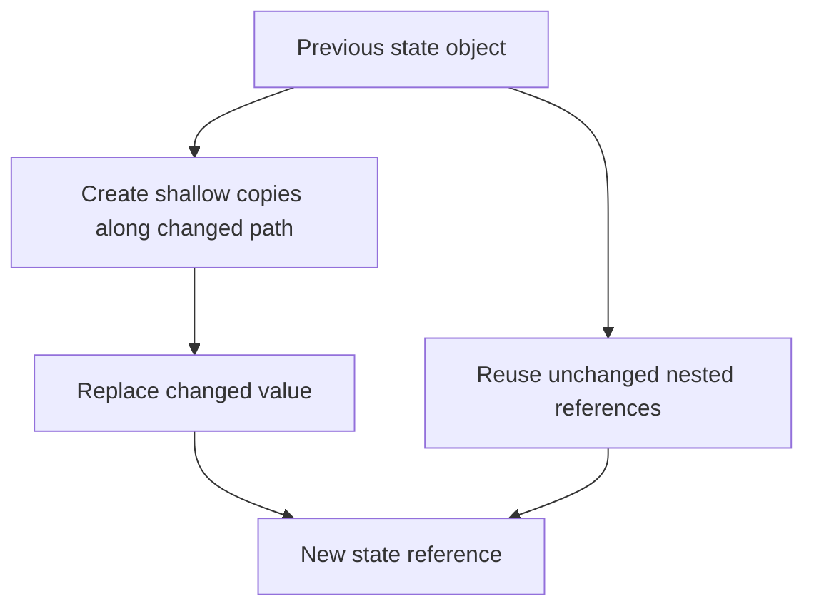

# Updating Objects and Arrays in State

## What it is

React state should be treated as immutable snapshots: create a new object or array when a value changes instead of mutating the existing snapshot.

## Why it exists

New references let React and application code observe change predictably while preserving prior snapshots.

## Beginner mental model

Copy the path that changes; reuse the parts that remain unchanged.



## How React handles it

React works from immutable render descriptions and state snapshots. It may calculate a component more than once, compare the new description with previous work, and commit only the selected host changes. The public model in this lesson is the contract to rely on; private Fiber fields and internal flags are implementation details.

## TypeScript example

```tsx
type Todo = {id: string; title: string; done: boolean};

function toggleTodo(todos: readonly Todo[], id: string): Todo[] {
  return todos.map((todo) =>
    todo.id === id ? {...todo, done: !todo.done} : todo,
  );
}
```

## Common mistakes

- Calling push, splice, or sort on state.
- Spreading only the top level while mutating a nested object.
- Deep-cloning the entire state tree for every small update.

## Debugging guidance

Start with observable evidence:

1. Inspect the props, state, and event values for the render in question.
2. Use React DevTools to inspect ownership and committed updates.
3. Verify element type, position, and key when state or DOM identity behaves unexpectedly.
4. Reduce the example until one source of truth and one transition remain.
5. Check the browser accessibility tree and event behavior for interactive UI.

Avoid diagnosing correctness from `console.log` count alone. Development Strict Mode and concurrent rendering can repeat render calculations without producing an extra visible commit.

## Performance implications

Correct ownership comes before memoization. Measure render frequency, render cost, DOM size, network work, and user-visible interaction latency separately. Use memoization, virtualization, deferred work, or the React Compiler only after identifying the actual bottleneck.

## Accessibility and security

Preserve native HTML semantics, keyboard behavior, focus, and accessible names. Normal JSX interpolation escapes text, but URLs, raw HTML, uploads, authentication, authorization, and server mutations remain explicit trust boundaries. TypeScript improves developer feedback; it does not validate untrusted runtime data.

## When to use it

Use this concept when it makes the component's ownership, data flow, identity, or interaction contract clearer.

## When not to use it

Do not add an abstraction merely to imitate a pattern. Prefer the simplest model that preserves one source of truth, clear responsibilities, platform semantics, and testable behavior.

## Production considerations

Normalize complex state where useful, keep updates local, and use reducers or immutable helpers for difficult transitions. Do not confuse immutability with serializability or runtime validation.

Test the observable user behavior, including loading, empty, error, retry, keyboard, and permission states when relevant. Keep monitoring and rollback paths for changes that affect critical workflows.

## Interview explanation

A strong explanation names the problem, gives the mental model, describes React's public behavior, shows a small example, and ends with the trade-offs. Avoid reciting an API signature without explaining ownership and identity.

## Summary

- React state should be treated as immutable snapshots: create a new object or array when a value changes instead of mutating the existing snapshot.
- Copy the path that changes; reuse the parts that remain unchanged.
- Correctness and clear ownership come before optimization.

## Practice exercises

1. Update one nested profile field immutably.
2. Remove and insert array items without mutation.
3. Explain when Immer can help and what rule it does not remove.

## Official references

- https://react.dev/learn
- https://react.dev/reference/react
- https://www.typescriptlang.org/docs/handbook/jsx.html
