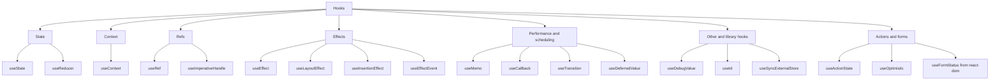
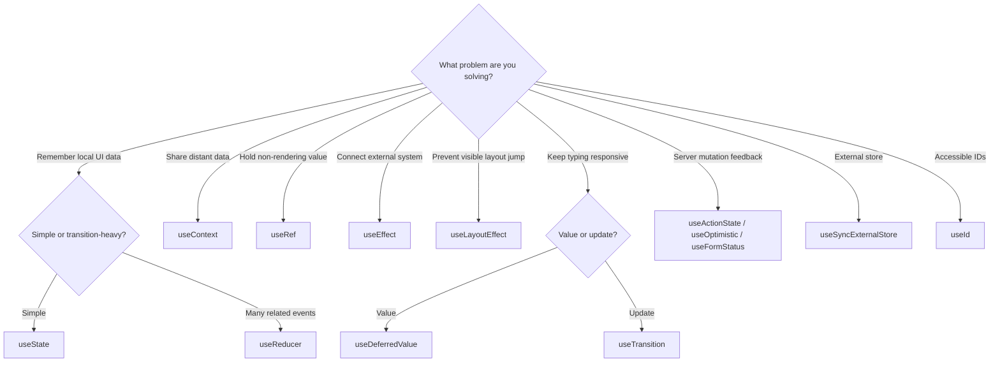

# Complete Built-in Hooks Reference

React Hooks let function components use state, context, refs, effects, scheduling, actions, accessibility IDs, external stores, and developer tooling.

This page is the coverage map for the handbook. It follows the React 19.2 reference and also includes `useOptimistic` and the web-only `useFormStatus` Hook.

## The complete map

## Hook directory

| Hook | Primary purpose | Use it when |
| --- | --- | --- |
| `useState` | Local component state | A component needs to remember a value |
| `useReducer` | State with explicit transition logic | Updates are related, complex, or event-shaped |
| `useContext` | Read and subscribe to context | Distant descendants need shared data |
| `useRef` | Hold mutable, non-rendering data or a DOM node | A value must survive renders without causing one |
| `useImperativeHandle` | Customize a component's exposed ref handle | A parent needs a small imperative API |
| `useEffect` | Synchronize with an external system | Connecting to browser, network, timers, or third-party code |
| `useLayoutEffect` | Measure or adjust layout before paint | A visible layout correction must happen synchronously |
| `useInsertionEffect` | Insert styles before layout effects | Building a CSS-in-JS library |
| `useEffectEvent` | Read latest values from non-reactive Effect logic | Effect-connected events should not resubscribe |
| `useMemo` | Cache a calculated value | A measured expensive calculation or stable derived value benefits |
| `useCallback` | Cache a function identity | Function identity matters to a memoized child or Hook dependency |
| `useTransition` | Mark updates as non-blocking | Expensive UI updates should not block urgent interaction |
| `useDeferredValue` | Defer a non-critical value | A slow subtree can lag behind an urgent input |
| `useDebugValue` | Label custom Hooks in React DevTools | Publishing or debugging reusable custom Hooks |
| `useId` | Create hydration-safe accessibility IDs | Connecting labels, descriptions, and controls |
| `useSyncExternalStore` | Subscribe safely to external stores | Reading state owned outside React |
| `useActionState` | Manage an Action result and pending state | Forms or mutations return state |
| `useOptimistic` | Show temporary optimistic state | The UI should respond before an Action finishes |
| `useFormStatus` | Read a parent form's submission status | A child button or status view reacts to form submission |

## Hooks versus the `use` API

`use(resource)` is a React API, but React's official built-in Hooks list does not classify it as a normal Hook. Unlike Hooks, `use` may be called inside loops and conditions, although it still must run while React is rendering a component or custom Hook.

## Selection flow

## Rules shared by Hooks

1. Call Hooks at the top level of a component or custom Hook.
2. Do not call ordinary Hooks inside loops, conditions, nested functions, or event handlers.
3. Keep components and Hook callbacks pure during rendering.
4. Treat dependency arrays as a description of values used, not as a manual scheduling tool.
5. Prefer deriving values during render before adding Effects or duplicated state.

## Production checklist

- Enable `eslint-plugin-react-hooks` and fix warnings instead of suppressing them.
- Measure before adding `useMemo` or `useCallback`.
- Prefer `useEffect` over `useLayoutEffect` unless a pre-paint measurement is required.
- Reserve `useInsertionEffect` for styling-library infrastructure.
- Use stable data IDs for records; `useId` is not a list-key generator.
- Keep optimistic UI recoverable when an Action fails.
- Test external stores under concurrent rendering and server rendering.

## Official references

- [Built-in React Hooks](https://react.dev/reference/react/hooks)
- [useOptimistic](https://react.dev/reference/react/useOptimistic)
- [Built-in React DOM Hooks](https://react.dev/reference/react-dom/hooks)
- [Rules of Hooks](https://react.dev/reference/rules/rules-of-hooks)
