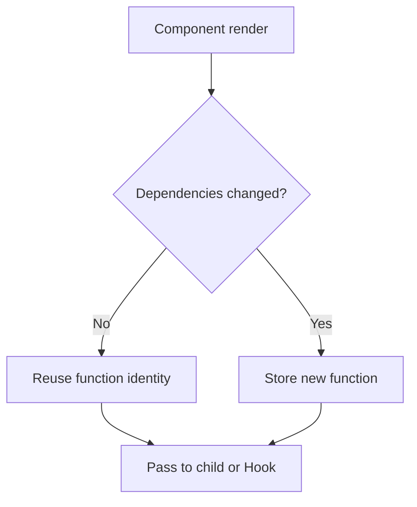

# useCallback

`useCallback` caches a function definition between renders until one of its dependencies changes.

```tsx
const cachedFunction = useCallback(fn, dependencies);
```

The function's behavior still comes from the values captured by the render that created it. `useCallback` stabilizes identity; it does not make the function run faster.



## Memoized child example

```tsx
import {memo, useCallback, useState} from 'react';

type SaveButtonProps = {
  onSave: (title: string) => Promise<void>;
};

const SaveButton = memo(function SaveButton({onSave}: SaveButtonProps) {
  return <button onClick={() => void onSave('Draft')}>Save</button>;
});

export function Editor({documentId}: {documentId: string}) {
  const [theme, setTheme] = useState<'light' | 'dark'>('light');

  const handleSave = useCallback(
    async (title: string) => {
      await fetch(`/api/documents/${documentId}`, {
        method: 'PUT',
        headers: {'content-type': 'application/json'},
        body: JSON.stringify({title}),
      });
    },
    [documentId],
  );

  return (
    <section data-theme={theme}>
      <SaveButton onSave={handleSave} />
      <button onClick={() => setTheme((value) => value === 'light' ? 'dark' : 'light')}>
        Toggle theme
      </button>
    </section>
  );
}
```

When only `theme` changes, `handleSave` keeps the same identity, so the memoized `SaveButton` can skip a render.

## When identity matters

Use `useCallback` when a function is:

- passed to a component wrapped in `memo`,
- used as a dependency of another Hook,
- returned from a reusable custom Hook whose consumers benefit from a stable API,
- registered with an imperative system that requires the same callback for cleanup,
- part of a measured render-performance boundary.

## When it does not help

If the child is not memoized, it will render with its parent anyway. A cached callback may add complexity without preventing work.

```tsx
// Usually unnecessary
const handleClick = useCallback(() => setOpen(true), []);
```

A direct function is often clearer unless identity has a demonstrated role.

## Dependencies and stale closures

Every reactive value read inside the callback belongs in the dependency list.

```tsx
const submit = useCallback(() => {
  save(projectId, draft);
}, [projectId, draft]);
```

Removing `draft` to keep the identity stable creates stale behavior. Solve unstable dependencies structurally rather than lying to the linter.

## Reduce dependencies with updater functions

```tsx
const addTodo = useCallback((text: string) => {
  setTodos((current) => [
    ...current,
    {id: crypto.randomUUID(), text},
  ]);
}, []);
```

The state updater receives the latest state, so `todos` does not need to be captured.

## useCallback and useMemo

These are conceptually related:

```tsx
useCallback(fn, dependencies);
useMemo(() => fn, dependencies);
```

Use `useCallback` when the cached value is a function and `useMemo` for calculated values.

## React Compiler note

React Compiler can automatically memoize many functions. Manual `useCallback` still matters at explicit API boundaries, for unsupported code, and when profiling proves stable identity is valuable. Avoid defensive memoization everywhere.

## Common mistakes

- Wrapping every event handler automatically.
- Omitting dependencies to force stable identity.
- Expecting it to stop the parent from rendering.
- Passing the callback to a non-memoized child and expecting a skipped render.
- Creating an unstable object dependency each render.
- Using it instead of fixing excessive state placement or expensive child work.

## Interview explanation

`useCallback` caches a function identity based on dependencies. It helps only where referential identity affects a memoized child, dependency, custom Hook API, or external subscription. It is not a universal speed improvement.

## Official reference

- [React: useCallback](https://react.dev/reference/react/useCallback)
