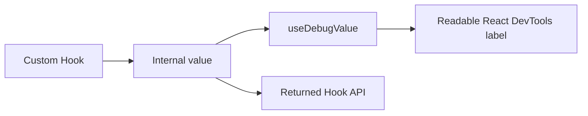

# useDebugValue

`useDebugValue` adds a label for a custom Hook in React DevTools.

```tsx
useDebugValue(value, format?);
```

It is most useful in reusable or published custom Hooks. It does not render UI, change state, or affect production behavior.



## Basic example

```tsx
import {useDebugValue, useEffect, useState} from 'react';

type NetworkStatus = 'online' | 'offline';

export function useNetworkStatus(): NetworkStatus {
  const [status, setStatus] = useState<NetworkStatus>(
    navigator.onLine ? 'online' : 'offline',
  );

  useDebugValue(status);

  useEffect(() => {
    const goOnline = () => setStatus('online');
    const goOffline = () => setStatus('offline');

    window.addEventListener('online', goOnline);
    window.addEventListener('offline', goOffline);

    return () => {
      window.removeEventListener('online', goOnline);
      window.removeEventListener('offline', goOffline);
    };
  }, []);

  return status;
}
```

React DevTools can display a label such as `NetworkStatus: online` for the Hook.

## Lazy formatting

Pass a formatter when creating the label is expensive. React DevTools calls it when the Hook is inspected.

```tsx
useDebugValue(user, (currentUser) =>
  currentUser ? `${currentUser.id}: ${currentUser.email}` : 'anonymous',
);
```

Without a formatter, expensive string building happens on every render even when DevTools is closed.

## Where to call it

Call `useDebugValue` inside the custom Hook whose state you want to explain.

```tsx
function useAuthSession() {
  const session = useSyncExternalStore(subscribe, getSnapshot, getServerSnapshot);
  useDebugValue(session, (value) => value.status);
  return session;
}
```

Do not scatter debugging labels through every low-level helper. Label the public abstraction that developers inspect.

## Good labels

A useful debug value answers one of these questions:

- What state is this Hook currently in?
- Which resource or key is it subscribed to?
- Is it idle, loading, successful, or failed?
- Which feature flag or external store snapshot is active?

Keep labels concise and avoid exposing secrets, tokens, personal data, or full payloads.

## Common mistakes

- Calling it in ordinary components instead of reusable custom Hooks.
- Expecting the label to appear in the rendered page.
- Formatting a large object eagerly on every render.
- Logging sensitive data into DevTools labels.
- Using it instead of proper error reporting or observability.
- Adding labels to every internal Hook and creating noise.

## Performance

The Hook itself is lightweight, but label preparation can be expensive. Use the optional formatter for derived strings, large collections, or structured objects.

## Testing

Application tests normally should not assert DevTools labels. Test the custom Hook's returned behavior. A library may add a small development-only test if the formatting function contains meaningful logic.

## Interview explanation

`useDebugValue` annotates a custom Hook in React DevTools. It improves developer experience for reusable abstractions and supports lazy formatting, but it does not affect rendering or state.

## Official reference

- [React: useDebugValue](https://react.dev/reference/react/useDebugValue)
