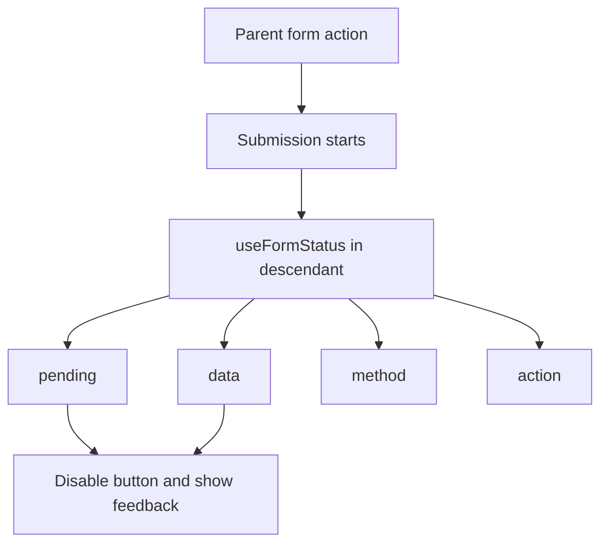

# useFormStatus

`useFormStatus` is a React DOM Hook that reads the status of the nearest parent `<form>` submission.

```tsx
const {pending, data, method, action} = useFormStatus();
```

Import it from `react-dom`, not `react`.

```tsx
import {useFormStatus} from 'react-dom';
```



## Pending submit button

The component calling `useFormStatus` must be rendered inside the form it observes.

```tsx
import {useFormStatus} from 'react-dom';

function SubmitButton() {
  const {pending} = useFormStatus();

  return (
    <button type="submit" disabled={pending} aria-busy={pending}>
      {pending ? 'Saving…' : 'Save profile'}
    </button>
  );
}

async function saveProfile(formData: FormData) {
  'use server';
  const displayName = String(formData.get('displayName') ?? '');
  await updateProfile({displayName});
}

export function ProfileForm() {
  return (
    <form action={saveProfile}>
      <label>
        Display name
        <input name="displayName" required />
      </label>
      <SubmitButton />
    </form>
  );
}
```

## Returned status

| Property | Meaning |
| --- | --- |
| `pending` | The parent form is actively submitting |
| `data` | The submitted `FormData`, or `null` when idle |
| `method` | The form method, normally `get` or `post` |
| `action` | The function passed to the parent form's `action`, or `null` |

## Read submitted data while pending

```tsx
function SubmissionSummary() {
  const {pending, data} = useFormStatus();
  const email = data?.get('email');

  if (!pending || typeof email !== 'string') return null;

  return <p role="status">Creating an account for {email}…</p>;
}
```

Do not expose secrets from `FormData` in the UI or logs. Passwords, tokens, and private fields should remain protected.

## The parent-form rule

This does not work:

```tsx
function IncorrectForm() {
  const {pending} = useFormStatus();

  return (
    <form action={submit}>
      <button disabled={pending}>Submit</button>
    </form>
  );
}
```

The Hook cannot observe a form rendered by the same component. Move it into a descendant:

```tsx
function CorrectButton() {
  const {pending} = useFormStatus();
  return <button disabled={pending}>Submit</button>;
}
```

## Multiple forms

A component reads only its nearest parent form. Place a status component inside each form so pending states do not leak across unrelated submissions.

## Accessibility

- Disable duplicate submission when appropriate.
- Keep the button's purpose understandable while pending.
- Use `aria-busy` for the affected control or region.
- Put progress text in a `role="status"` live region when users need an announcement.
- Do not remove the submit button and cause focus loss.
- Preserve error messages after the Action settles.

## useFormStatus versus useActionState

`useFormStatus` reads submission metadata from a parent form. `useActionState` owns the state returned by an Action and provides its own pending flag. They can be used together: the form-level Action manages result state while a nested button reads local form status.

## Common mistakes

- Importing from `react` instead of `react-dom`.
- Calling it outside a parent form.
- Calling it in the same component that renders the form.
- Expecting it to track a child form.
- Using one global pending state for multiple independent forms.
- Rendering submitted secrets from `status.data`.

## Interview explanation

`useFormStatus` is a web-only React DOM Hook. A descendant component uses it to read the nearest parent form's pending state and submission metadata without threading props through the form tree.

## Official references

- [React DOM: useFormStatus](https://react.dev/reference/react-dom/hooks/useFormStatus)
- [Built-in React DOM Hooks](https://react.dev/reference/react-dom/hooks)
