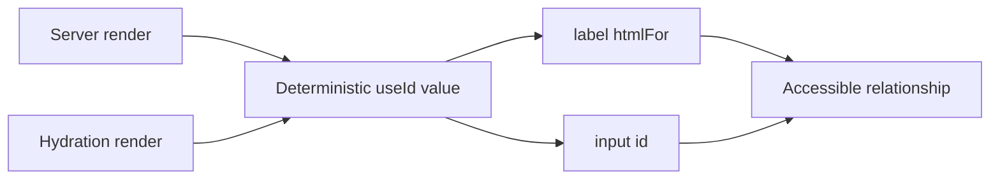

# useId

`useId` creates a unique ID that is stable for a component instance and consistent between server rendering and hydration.

```tsx
const id = useId();
```

## Why it exists

Accessible HTML often connects elements through matching IDs:

- `<label htmlFor="...">` and `<input id="...">`
- `aria-describedby` and help text
- `aria-labelledby` and a visible heading
- grouped controls that need related identifiers

Hardcoded IDs collide when a reusable component appears more than once. Random IDs can disagree between the server and browser. `useId` solves both problems.



## Basic TypeScript example

```tsx
import {useId} from 'react';

type EmailFieldProps = {
  label: string;
  hint?: string;
};

export function EmailField({label, hint}: EmailFieldProps) {
  const baseId = useId();
  const inputId = `${baseId}-input`;
  const hintId = `${baseId}-hint`;

  return (
    <div>
      <label htmlFor={inputId}>{label}</label>
      <input
        id={inputId}
        name="email"
        type="email"
        aria-describedby={hint ? hintId : undefined}
      />
      {hint ? <p id={hintId}>{hint}</p> : null}
    </div>
  );
}
```

Render `<EmailField />` several times and every instance receives a different base ID without requiring the parent to invent one.

## Create related IDs from one base

Call `useId` once and derive suffixes when several elements form one accessible unit.

```tsx
const id = useId();
const titleId = `${id}-title`;
const descriptionId = `${id}-description`;
```

This keeps the relationship obvious and avoids unnecessary Hook calls.

## Do not use useId for list keys

```tsx
// Incorrect
{users.map((user) => (
  <UserRow key={useId()} user={user} />
))}
```

Hooks cannot be called inside `map`, and generated component IDs do not describe data identity. Use a stable value from the record:

```tsx
{users.map((user) => (
  <UserRow key={user.id} user={user} />
))}
```

## Do not generate random hydration IDs

```tsx
// Risky during SSR and hydration
const id = crypto.randomUUID();
```

The server and browser may create different values. React would then hydrate markup whose accessibility attributes do not match.

## Multiple React roots

When a page contains multiple independent React roots, configure a distinct `identifierPrefix` for each root through `createRoot` or `hydrateRoot`. This prevents IDs generated by separate roots from colliding.

## Common mistakes

- Using `useId` as a database or API identifier.
- Using it for list keys.
- Putting an ID into state even though it never changes.
- Calling it conditionally.
- Hardcoding one `id` inside a reusable field component.
- Assuming the returned value has a meaningful human-readable format.

## Testing

Prefer queries based on accessible roles and names instead of asserting the exact generated string.

```tsx
expect(screen.getByRole('textbox', {name: /email/i})).toBeInTheDocument();
```

The exact ID format is an implementation detail. Test the relationship and user behavior.

## Interview explanation

`useId` creates a component-instance ID designed for accessibility relationships and SSR hydration consistency. It is not for list keys or persistent business identifiers.

## Official reference

- [React: useId](https://react.dev/reference/react/useId)
