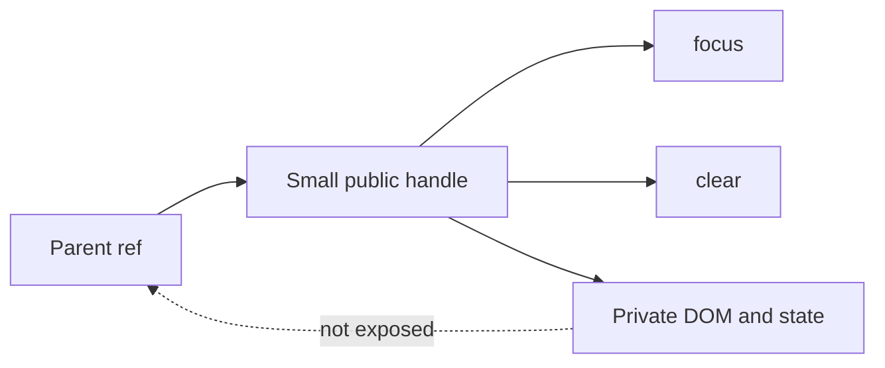

# useImperativeHandle

`useImperativeHandle` customizes the value a parent receives through a ref.

```tsx
useImperativeHandle(ref, createHandle, dependencies);
```

Use it rarely. Prefer props and declarative state for normal communication. It is appropriate when a parent genuinely needs an imperative action such as focusing, scrolling, selecting text, or resetting an integration.



## React 19 ref prop example

In React 19, function components can receive `ref` as a prop.

```tsx
import {useImperativeHandle, useRef} from 'react';

type SearchInputHandle = {
  focus: () => void;
  clear: () => void;
};

type SearchInputProps = {
  ref: React.Ref<SearchInputHandle>;
  value: string;
  onChange: (value: string) => void;
};

export function SearchInput({ref, value, onChange}: SearchInputProps) {
  const inputRef = useRef<HTMLInputElement>(null);

  useImperativeHandle(
    ref,
    () => ({
      focus() {
        inputRef.current?.focus();
      },
      clear() {
        onChange('');
        inputRef.current?.focus();
      },
    }),
    [onChange],
  );

  return (
    <input
      ref={inputRef}
      value={value}
      onChange={(event) => onChange(event.target.value)}
    />
  );
}
```

The parent receives only `focus` and `clear`, not the internal `<input>` node.

```tsx
import {useRef, useState} from 'react';

export function SearchPanel() {
  const [query, setQuery] = useState('');
  const searchRef = useRef<SearchInputHandle>(null);

  return (
    <section>
      <SearchInput ref={searchRef} value={query} onChange={setQuery} />
      <button onClick={() => searchRef.current?.focus()}>Focus search</button>
      <button onClick={() => searchRef.current?.clear()}>Clear</button>
    </section>
  );
}
```

## Dependency behavior

React recreates the handle when a listed dependency changes. Include every reactive value used by `createHandle`.

```tsx
useImperativeHandle(ref, () => ({save: () => saveDraft(draftId)}), [draftId]);
```

Do not omit dependencies to freeze stale props or state inside the handle.

## When it is appropriate

- Focus an input after a parent-level action.
- Scroll a virtualized or composite widget to a position.
- Expose `play`, `pause`, or `seek` for a media abstraction.
- Bridge to a third-party imperative widget.
- Expose a constrained API from a design-system component.

## Prefer declarative alternatives when possible

Instead of exposing `open()` from a dialog, consider an `open` prop and `onOpenChange` callback. Declarative APIs are easier to trace, synchronize, test, and render on the server.

## Common mistakes

- Exposing the entire DOM node when two safe methods are enough.
- Using refs to send ordinary data upward.
- Mutating child state from a parent instead of passing props.
- Forgetting reactive dependencies.
- Assuming calling a method before mount is safe; `ref.current` can be `null`.
- Creating a large command object that tightly couples parent and child.

## Testing

Test the user-visible result of invoking the handle. Keep direct handle assertions small and focused on public behavior.

## Interview explanation

`useImperativeHandle` lets a component define the object exposed through its ref. It is an escape hatch for small imperative capabilities, not a replacement for props or state.

## Official reference

- [React: useImperativeHandle](https://react.dev/reference/react/useImperativeHandle)
