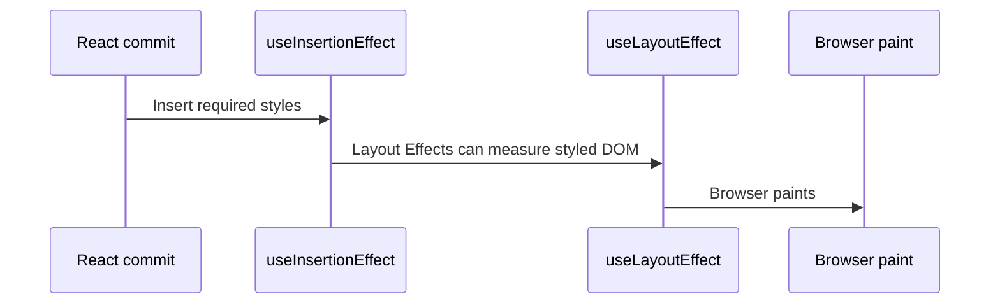

# useInsertionEffect

`useInsertionEffect` lets styling libraries insert dynamic CSS before React runs layout Effects.

```tsx
useInsertionEffect(setup, dependencies);
```

This Hook is primarily for CSS-in-JS library authors. Normal application code should use static CSS, CSS Modules, utility classes, inline styles, `useEffect`, or `useLayoutEffect` as appropriate.



## The problem it solves

A runtime styling library may discover a style rule while rendering a component. If the rule is inserted too late, a layout Effect can measure an unstyled element or the user can see a flash of unstyled content.

`useInsertionEffect` gives the library an earlier insertion point so layout measurement sees the intended styles.

## Minimal library-style example

```tsx
import {useInsertionEffect} from 'react';

const insertedRules = new Set<string>();

function useDynamicRule(className: string, rule: string) {
  useInsertionEffect(() => {
    if (insertedRules.has(className)) return;

    const style = document.createElement('style');
    style.dataset.runtimeClass = className;
    style.textContent = `.${className} { ${rule} }`;
    document.head.appendChild(style);
    insertedRules.add(className);

    return () => {
      // Real libraries normally use reference counting and shared sheets.
      style.remove();
      insertedRules.delete(className);
    };
  }, [className, rule]);
}
```

This is intentionally simplified. Production styling engines need deduplication, ordering, SSR extraction, hydration, nonce support, reference counting, and efficient shared stylesheets.

## Important caveats

- It runs only on the client.
- You cannot update React state from it.
- Refs are not guaranteed to be attached yet.
- Do not rely on whether the DOM has already been updated.
- Cleanup and setup run one component at a time, unlike the grouped behavior of other Effects.
- It is not a faster replacement for `useEffect`.

## Why application code should avoid it

Application components almost never need to inject styles at this phase. Using it for analytics, subscriptions, DOM measurement, fetching, or state synchronization is incorrect.

Choose instead:

| Need | Better tool |
| --- | --- |
| Subscribe to an API | `useEffect` |
| Measure DOM before paint | `useLayoutEffect` |
| Apply conditional styles | class names or inline styles |
| Load a stylesheet | framework metadata or a `<link>` |
| Build a runtime CSS engine | `useInsertionEffect` |

## Security considerations

Dynamic CSS can become an injection boundary. Never concatenate untrusted user input into style rules. A library should sanitize or constrain values, support Content Security Policy nonces where required, and avoid leaking sensitive data through generated selectors or URLs.

## Server rendering

A production CSS-in-JS library needs a server extraction strategy because Effects do not run during server rendering. The server must emit required rules with the HTML, and the client must hydrate without inserting duplicates.

## Common mistakes

- Calling `setState` inside the insertion Effect.
- Reading a DOM ref and expecting it to exist.
- Performing layout measurement.
- Fetching data or attaching event listeners.
- Creating one `<style>` element per render without deduplication.
- Treating it as a general “run first” Hook.

## Interview explanation

`useInsertionEffect` is a specialized Hook for style engines. It inserts CSS early enough that layout Effects measure the final styled layout. It has strict limitations and is rarely appropriate in product components.

## Official reference

- [React: useInsertionEffect](https://react.dev/reference/react/useInsertionEffect)
