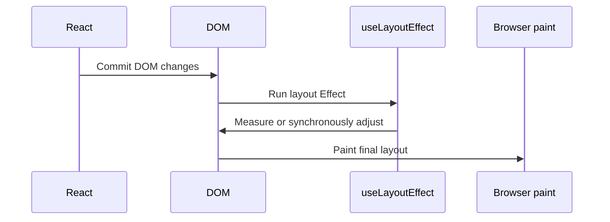

# useLayoutEffect

`useLayoutEffect` is an Effect that runs after React updates the DOM but before the browser paints the result.

```tsx
useLayoutEffect(setup, dependencies);
```

It is useful when the user must not see an intermediate layout. Because it blocks painting, prefer `useEffect` unless pre-paint measurement or correction is necessary.



## Tooltip measurement example

```tsx
import {useLayoutEffect, useRef, useState} from 'react';

type Position = 'above' | 'below';

export function Tooltip({children}: {children: React.ReactNode}) {
  const tooltipRef = useRef<HTMLDivElement>(null);
  const [position, setPosition] = useState<Position>('below');

  useLayoutEffect(() => {
    const element = tooltipRef.current;
    if (!element) return;

    const rect = element.getBoundingClientRect();
    if (rect.bottom > window.innerHeight) {
      setPosition('above');
    }
  }, []);

  return (
    <div ref={tooltipRef} data-position={position} role="tooltip">
      {children}
    </div>
  );
}
```

React commits the tooltip, the layout Effect measures it, and React can correct its position before the browser paints.

## useEffect versus useLayoutEffect

| Question | `useEffect` | `useLayoutEffect` |
| --- | --- | --- |
| Runs before paint | No | Yes |
| Blocks paint | No | Yes |
| Good for subscriptions and network connections | Yes | Usually no |
| Good for synchronous layout measurement | Sometimes too late | Yes |
| Runs during server rendering | No | No |

Use `useEffect` for most synchronization. Move to `useLayoutEffect` only when a visible flicker or incorrect first paint proves that timing matters.

## Cleanup order

Before React runs a changed layout Effect again, it runs the previous cleanup. Cleanup also runs when the component unmounts.

```tsx
useLayoutEffect(() => {
  const observer = new ResizeObserver(recalculate);
  observer.observe(element);
  return () => observer.disconnect();
}, [element]);
```

## Server rendering caveat

The server has no layout information, so layout Effects cannot run there. Components that fundamentally require browser layout should either:

- render a server-safe placeholder,
- delay the layout-dependent part until hydration,
- or be isolated behind a client-only boundary in the framework.

Do not use a layout Effect simply to silence a server-rendering warning; redesign the boundary.

## Performance risks

Everything scheduled inside `useLayoutEffect` delays the browser's paint. Keep the work small:

- read only the geometry you need,
- avoid repeated read/write/read cycles that cause layout thrashing,
- batch related DOM reads before DOM writes,
- avoid network requests and expensive calculations,
- profile before adding synchronous measurement.

## Common mistakes

- Replacing every `useEffect` with `useLayoutEffect` to make code run sooner.
- Measuring DOM during render.
- Triggering a long calculation before paint.
- Omitting cleanup for observers or global listeners.
- Updating state unconditionally and creating a render loop.
- Expecting it to run on the server.

## Debugging checklist

1. Confirm the bug is a visible pre-paint layout problem.
2. Inspect whether CSS alone can solve it.
3. Measure the exact DOM node through a ref.
4. Check dependencies for unstable objects or callbacks.
5. Use the Performance panel to find forced layouts and long tasks.

## Interview explanation

`useLayoutEffect` runs after DOM commit but before paint. It is appropriate for synchronous measurement and correction that must be invisible to the user, but it should be rare because it blocks rendering.

## Official reference

- [React: useLayoutEffect](https://react.dev/reference/react/useLayoutEffect)
