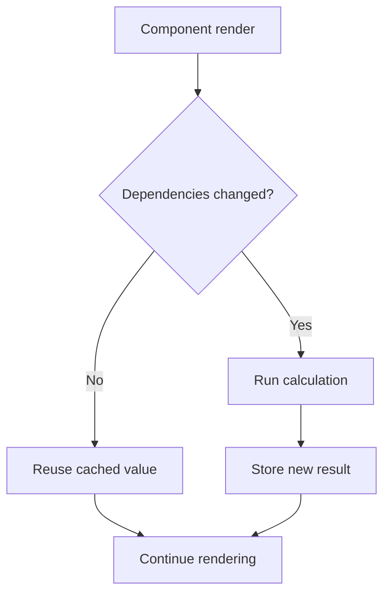

# useMemo

`useMemo` caches the result of a calculation between renders until one of its dependencies changes.

```tsx
const cachedValue = useMemo(calculateValue, dependencies);
```

It is a performance optimization. Your component must remain correct if React recalculates the value.



## Expensive calculation example

```tsx
import {useMemo} from 'react';

type Product = {
  id: string;
  name: string;
  price: number;
};

type ProductListProps = {
  products: Product[];
  query: string;
  maximumPrice: number;
};

export function ProductList({products, query, maximumPrice}: ProductListProps) {
  const visibleProducts = useMemo(() => {
    const normalizedQuery = query.trim().toLowerCase();

    return products
      .filter((product) => product.price <= maximumPrice)
      .filter((product) => product.name.toLowerCase().includes(normalizedQuery))
      .sort((a, b) => a.price - b.price);
  }, [products, query, maximumPrice]);

  return (
    <ul>
      {visibleProducts.map((product) => (
        <li key={product.id}>{product.name}</li>
      ))}
    </ul>
  );
}
```

Without `useMemo`, this can still be correct. Add memoization only after measurement shows the calculation matters or when a stable derived value is needed by another optimization.

## Dependency behavior

React compares each dependency with its previous value using `Object.is`.

```tsx
const result = useMemo(() => buildReport(records, options), [records, options]);
```

If `options` is recreated on every render, the memo recalculates every time. Prefer stable primitives or move object creation inside the calculation:

```tsx
const result = useMemo(
  () => buildReport(records, {sort, direction}),
  [records, sort, direction],
);
```

## Good use cases

- A measured expensive filter, transformation, parser, or layout calculation.
- A derived object passed to a memoized child where identity matters.
- A value used as a dependency by another memoized calculation or Effect.
- Avoiding repeated construction of an expensive third-party configuration.

## Poor use cases

```tsx
// Usually unnecessary
const fullName = useMemo(() => `${firstName} ${lastName}`, [firstName, lastName]);
```

Simple calculations are usually cheaper and clearer without memoization.

## Do not use it for side effects

The calculation must be pure.

```tsx
// Incorrect
const data = useMemo(() => {
  analytics.track('render');
  return transform(input);
}, [input]);
```

Rendering may be restarted, repeated, or abandoned. Side effects belong in events or Effects.

## Do not depend on the cache for correctness

React may discard cached values in development or for implementation reasons. `useMemo` is not state, persistence, or a semantic guarantee.

Use `useState`, `useRef`, an external cache, or framework data cache when the value must be retained for correctness.

## React Compiler note

React Compiler can automatically memoize many values and calculations. Manual `useMemo` remains useful for deliberate performance boundaries, unsupported code, library APIs that require stable identity, and measured hot paths. Do not add it everywhere by habit.

## Common mistakes

- Omitting a dependency to keep stale data cached.
- Memoizing trivial arithmetic or string interpolation.
- Mutating props inside the calculation, such as sorting the original array.
- Using it for data fetching or subscriptions.
- Creating an unstable object dependency outside the memo.
- Assuming it prevents the component itself from rendering.

## Measuring value

Use the React Profiler and browser Performance tools. Compare render duration and interaction responsiveness before and after memoization. Remember that maintaining a cache also has a cost.

## Interview explanation

`useMemo` caches a pure calculation result based on dependencies. It is useful for measured expensive work or stable identity, but correctness cannot rely on the cache and trivial calculations should remain direct.

## Official reference

- [React: useMemo](https://react.dev/reference/react/useMemo)
