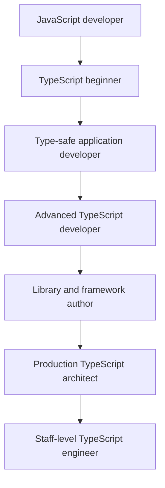
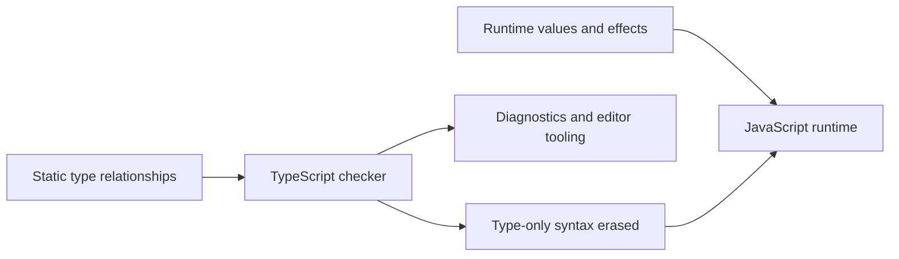

# TypeScript Developer Handbook

This handbook teaches TypeScript as an engineering system layered on JavaScript. It begins with runtime fundamentals and static-type mental models, then progresses through application development, advanced type transformations, framework integration, library authoring, architecture, performance, security, production operations, projects, and interviews.

> **Compatibility baseline checked August 1, 2026:** TypeScript 7.0.2, Node.js 24 LTS for handbook CI, strict checking, explicit runtime-specific module settings, and current React, Vue, Zod, ESLint, Vitest, Jest, Vite, and npm documentation.

## The core distinction

TypeScript does not replace JavaScript and does not validate network responses, JSON, environment variables, database records, or user input. External data begins as `unknown`, passes through runtime validation, and only then becomes a trusted domain value.

## How the handbook is organized

The sidebar contains focused lessons rather than large numbered chapter ranges. Old bundled routes remain as overview pages so existing links continue to work. Every lesson includes a mental model, runtime and compile-time behavior, examples, an incorrect design, a safer design, diagnostic guidance, production implications, an interview explanation, and exercises.

Start with **Version Baseline**, **Learning Path**, and **Prerequisites**, then work sequentially or use the reference and audit section for targeted lookup.
