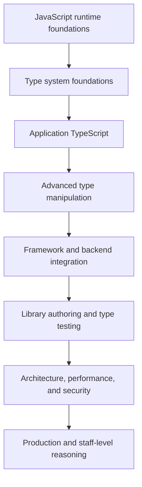

# Learning Path

## Foundation checkpoint

Learn JavaScript values, scope, objects, functions, classes, promises, modules, and the event loop. Then learn inference, annotations, assignability, structural typing, widening, narrowing, primitives, literals, arrays, tuples, objects, and functions.

**Evidence:** explain the runtime/static distinction and solve basic diagnostics without `any`.

## Application checkpoint

Learn unions, discriminated variants, interfaces, generics, `keyof`, indexed access, `typeof`, utility types, null handling, errors, async code, modules, strict TSConfig, Node.js, React, Vue, runtime validation, APIs, and database boundaries.

**Evidence:** build an application that validates external data and keeps transport, domain, and storage types separate.

## Advanced checkpoint

Learn mapped, conditional, inferred, and template-literal types; variance; branded and opaque types; type-level recursion; project references; declaration files; type tests; and checker performance.

**Evidence:** design a reusable typed API with positive and negative contract tests.

## Production and staff checkpoint

Learn package authoring, migration, security, CI, observability, version upgrades, rollback, ownership boundaries, monorepos, multi-tenancy, and system design.

**Evidence:** defend trade-offs, evolve a public type contract safely, diagnose a slow or failing build, and lead a TypeScript migration.

Use the **Projects**, **Exercises**, and **Interview Preparation** sections after each checkpoint rather than waiting until the end.
