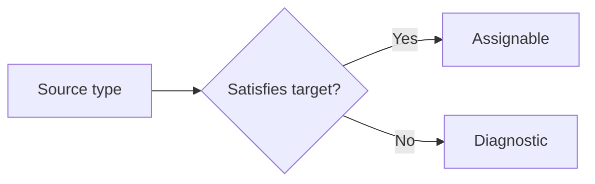

import DynamicTypeScriptDoc from '@site/src/components/TypeScriptLesson/Dynamic';

## Visual model

```mermaid
flowchart LR
  SOURCE["Source type"] --> COMPARE{"Satisfies target?"}
  COMPARE -->|Yes| OK["Assignable"]
  COMPARE -->|No| ERROR["Diagnostic"]
```

<DynamicTypeScriptDoc />
